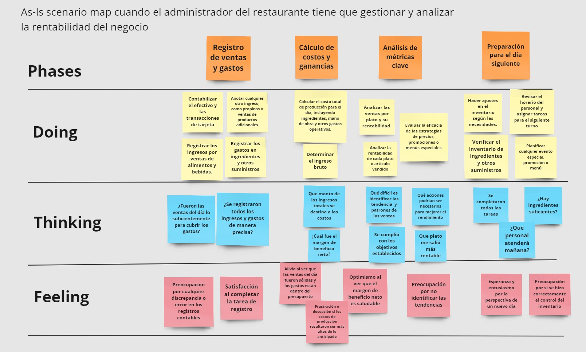

# Capítulo II: Requirements Elicitation & Analysis
----
## 2.1. Competidores.
**1.Manzana Verde:** Es una aplicación que ofrece una manera conveniente y personalizada de acceder a comida saludable a domicilio, con opciones flexibles y servicios adicionales como el uso de planes de suscripción, de esta manera tratan de ayudarte a alcanzar tus objetivos nutricionales y mantener un estilo de vida saludable.

**2.Lifesum:** Es una aplicación que te ayuda a monitorear y mejorar tus hábitos de alimentación y actividad física. Permite registrar tu comida, llevar un registro de sus calorías consumidas y seguir dietas personalizadas. Además, tiene una función llamada “Life Score” que le permite ver su registro alimenticio y le brinda asesoramiento para sus alimentos .

**3.KnowEats** Esta empresa se enfoca en poder proporcionar packs de diferentes platos saludables. Ellos tratan que sus usuarios escojan los diferentes platos el 1er día de la semana para que ya puedan tener lista de su orden y puedan entregarlo a su domicilio. Además los platos que elijas puedes mantenerlos en la nevera y pueden durar entre 7 a 8 días.
### 2.1.1. Análisis competitivo.
<head>
    <meta charset="UTF-8">
    <meta name="viewport" content="width=device-width, initial-scale=1.0">
    <link rel="stylesheet" href="style.css">
</head>
<body>
    <table border="1px">
        <thead>
            <th colspan="11">Competitive Analysis Landscepe</th>
        </thead>
        <tbody>
            <tr>
                <td rowspan="2" colspan="2">¿Por qué llevar a
                    cabo este análisis?</td>
                <td colspan="9">Escriba en el recuadro la pregunta que busca responder o el objetivo de
                    este análisis.</td>
            </tr>
            <tr>
                <td colspan="9">Buscamos descubrir nuestras ventajas y desventajas con respecto a nuestros competidores.</td> 
            </tr>
            <tr>
                <tr>
                    <td colspan="3">(En la cabecera colocar por cada competidor nombre y logo)</td>
                    <td colspan="2">FastBite</td>
                    <td colspan="2"> Manzana Verde</td>
                    <td colspan="2"> Lifesum</td>
                    <td colspan="2"> KnowEats</td>
                </tr>
            </tr>
            <tr>
                <td rowspan="2" colspan="1">Perfil</td>
                <td colspan="2">Overview</td>
                <td colspan="2">Nuestro startup sirve para que los usuarios de diferentes empresas puedan acceder a diferentes menús de nuestros restaurantes afiliados y puedan ordenarlo.</td>
                <td colspan="2">Esta aplicación brinda una forma de ordenar diferentes platos saludables para cumplir uno de sus tres objetivos (Bajar de peso, Mantenerse saludable y Aumentar la masa corporal)</td>
                <td colspan="2">Una aplicación que ayuda a monitorear y establecer mejores hábitos de alimentación. También emplean dietas que puedes seguir según tu objetivo.</td>
                <td colspan="2">Aplicación de envío de comida que ayuda a la gente con una dieta balanceada y deliciosa. Asegura que sus productos pueden durar hasta 8 días sin perecer.</td>
            </tr>
            <tr>
                <td colspan="2">Ventaja
                    competitiva
                    ¿Qué valor
                    ofrece a los
                    clientes?</td>
                <td colspan="2">Provisionamos un plan de suscripción con un monto fijo para que los usuarios puedan ordenar sus menús, este mismo cubrirá el gasto de cada menú que ordene.</td>
                <td colspan="2">Contiene diferentes planes de suscripción para que sus usuarios puedan utilizar los beneficios que emplean</td>
                <td colspan="2">Emplean un servicio extra llamado “Life Score”, esta función permite verificar tu registro alimenticio y darte un asesoramiento sobre qué alimento puedes consumir.</td>
                <td colspan="2">Gracias a su sistema de “cook and chill”, con el que envasan en caliente y bajan rápidamente la temperatura de los platos para evitar la proliferación de microorganismos.</td>
            </tr>
            <tr>
                <td rowspan="2" colspan="1">Perfil de Marketing</td>
                <td colspan="2">Mercado Objetivo</td>
                <td colspan="2">Empresas que buscan servicio de comida para sus empleados.</td>
                <td colspan="2">Personas en búsqueda de un mejor plan alimenticio a domicilio.</td>
                <td colspan="2">Personas con objetivos alimenticios que les ayude a contar sus calorías.</td>
                <td colspan="2">Personas con poco tiempo para cocinar y que necesiten guardar la comida.</td>
            </tr>
            <tr>
                <td colspan="2">Estrategia de Marketing</td>
                <td colspan="2">Nuestra opción de publicidad vendría ser el convenio con los restaurantes y las empresas disponibles del servicio.</td>
                <td colspan="2">Publicidad en redes sociales.</td>
                <td colspan="2">Publicidad en redes sociales.</td>
                <td colspan="2">Publicidad en redes sociales.</td>
            </tr>
            <tr>
                <td rowspan="3" colspan="1">Perfil de Producto</td>
                <td colspan="2">Producto & Servicio</td>
                <td colspan="2">El producto es la aplicación móvil y el servicio es poder brindar diferentes menús de los restaurantes afiliados a nosotros.</td>
                <td colspan="2">El producto es la aplicación móvil y el servicio es adquirir platos saludables y llevar Objetivo nutricional que brinda su aplicación.</td>
                <td colspan="2">El producto es una aplicación móvil y el servicio es la gestión de tus calorías, asesoramiento alimenticio y hábitos nutricionales.</td>
                <td colspan="2">El producto es el sitio web y el servicio es que sus usuarios escojan una cantidad de platos que desean comer y ellos les proporcionarán un pack de los platos seleccionados.</td>
            </tr>
            <tr>
                <td colspan="2">Precio & Costos  </td>
                <td colspan="2">.....</td>
                <td colspan="2">Planes de suscripción desde S/15.50 x día.</td>
                <td colspan="2">Plan de suscripción desde 8,33 US$.</td>
                <td colspan="2">Costo mínimo del pedido es de 20€ y el precio de los platos de 6 a 9€.</td>
            </tr>
            <tr>
                <td colspan="2">Canalaes de distribucion (web y/o Movil)</td>
                <td colspan="2">Sitio Web y Aplicación móvil</td>
                <td colspan="2">Sitio Web y Aplicación móvil</td>
                <td colspan="2">Sitio Web y Aplicación móvil</td>
                <td colspan="2">Sitio Web</td>
            </tr>
            <tr>
                <td rowspan="5">Analisis SWOT</td>
                <td colspan="10">Realice esto para su startup y sus competidores. Sus fortalezas deberían apoyar sus
                    oportunidades y contribuir a lo que ustedes definen como su posible ventaja
                    competitiva</td>
            </tr>
            <tr>
                <td colspan="2">Fortalezas</td>
                <td colspan="2">Gestión de restaurantes y empresas para ayudarles a tener el mejor rendimiento.</td>
                <td colspan="2">Gestión de planes alimenticios para cumplir un objetivo seleccionado</td>
                <td colspan="2">Gestión de calorías y asesoramiento en hábitos alimenticios.</td>
                <td colspan="2">Brinda la facilidad de poder disponer de más tiempo para realizar otras actividades sin preocuparse de cocinar diferentes platos.</td>
            </tr>
            <tr>
                <td colspan="2">Debilidades</td>
                <td colspan="2">Mantener el sitio web actualizado y un elevado costo de mantenimiento</td>
                <td colspan="2">No soporta grandes cantidades de pedidos.</td>
                <td colspan="2">Que sus usuarios no logren cumplir sus objetivos o hábitos. </td>
                <td colspan="2">Demora en la degustación de la comida, debido a que se necesita calentar.</td>
            </tr>
            <tr>
                <td colspan="2">Oportunidades</td>
                <td colspan="2">Creación de diferentes planes para que los usuarios tengan una opción de lo que deseen obtener. </td>
                <td colspan="2">Dispone de un plan nutricional que beneficia a los usuarios y logran cumplir sus objetivos alimenticios.</td>
                <td colspan="2">Los asesoramientos que brindan benefician a los usuarios que necesiten un cambio en su forma de alimentarse</td>
                <td colspan="2">Brindar una ayuda para los usuarios que no disponen de tiempo para preparar sus comidas. </td>
            </tr>
            <tr>
                <td colspan="2">Amenazas</td>
                <td colspan="2">El poco uso que se brindan a las aplicaciones similares.</td>
                <td colspan="2">El desinterés y los costos de mantenimiento de los servicios.</td>
                <td colspan="2">El incremento de costos y mantenimiento.</td>
                <td colspan="2">El desinterés y los costos de mantenimiento de los servicios.</td>
            </tr>
        </tbody>
    </table>
</body>

### 2.1.2. Estrategias y tácticas frente a competidores.

* Para que nuestra startup pueda sobresalir en el mercado de comidas personalizadas para empresas, es crucial que podamos enfocarnos en la diferenciación del producto mediante un sistema avanzado de personalización y una amplia variedad de opciones de menú de calidad. 

* Nuestra plataforma tambien serviria como un medio donde se pueda hacer marketing de los restaurantes ques son mejor valoradas por las empreas.

* La aplicacion tendria un apartado especial para los restaurantes afiliados, donde podrian ver estadisticas y metricas clave de su negocio, esto para que puedan tomar decisiones informadas.
## 2.2. Entrevistas.

### 2.2.1. Diseño de entrevistas.

### 2.2.2. Registro de entrevistas.

### 2.2.3. Análisis de entrevistas.

## 2.3. Needfinding.

### 2.3.1. User Personas.

### 2.3.2. User Task Matrix.

### 2.3.3. User Journey Mapping.

### 2.3.4. Empathy Mapping.

### 2.3.5. As-is Scenario Mapping.
**Segmento de Objetivo:** Administrador del restaurante tiene que gestionar y analizar la rentabilidad del negocio.

## 2.4. Ubiquitous Language.