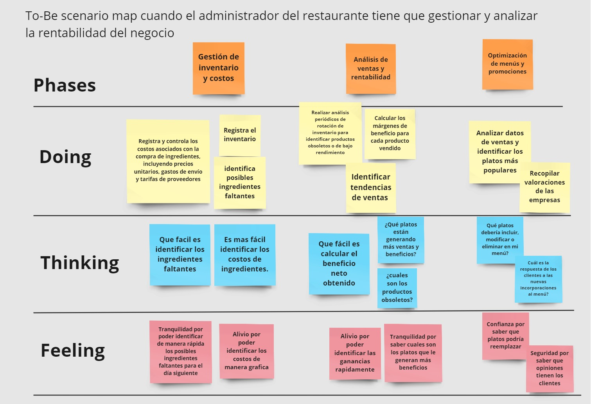

# Chapter III: Requirements Specification
----
## 3.1. To-Be Scenario Mapping.

**Segmento objetivo:** Administrador de la empresa que brinda almuerzo a sus empleados

**Segmento objetivo:** El administrador del restaurante tiene que gestionar y analizar la rentabilidad del negocio.

## 3.2. User Stories.
### Epics
| Epics ID  | Titulo    | Descripcón|
|-----------|-----------|-----------|
| EP001 | Gestión de cuenta | Como usuario quiero poder acceder a mi cuenta de manera segura y personalizar mis datos de perfil para hacer uso de sus funcionalidades. |
| EP002 | Gestión de Pedidos Corporativos | Como administrador de empresa suscrita, Quiero poder realizar pedidos en nombre de todos los empleados desde una única cuenta corporativa, Para simplificar y agilizar el proceso de pedido de almuerzos y garantizar una alimentación adecuada para todos los empleados |
| EP003 | Gestión de Restaurantes Afiliados | Como administrador del restaurante afiliado quiero poder actualizar los menús diarios y recibir las órdenes a través de la plataforma para que el flujo del trabajo sea más optimizado. |
| EP004 | Gestión y Análisis de Datos para Restaurantes Afiliados | Como administrador del restaurante afiliado, quiero tener acceso a herramientas y análisis que me permitan ver las métricas clave de mi negocio, para tomar decisiones informadas y optimizar la rentabilidad y eficiencia de mi restaurante. |
| EP005 | Control de Inventario y Gestión de Productos | Como administrador del restaurante afiliado, quiero poder registrar y actualizar fácilmente los productos e ingredientes en mi control de inventario, para asegurarme de que tenga suficientes insumos para preparar los pedidos. |
| EP006 | Procesamiento de Pagos y Facturación | Como usuario quiero poder registrar una tarjeta de crédito para realizar los movimientos financieros como pago de la suscripción o retiro de ganancias Para garantizar un proceso de pago sin complicaciones y de manera segura. |
| EP007 | Información de la aplicación web | Como visitante quiero saber información de la aplicación web para ver si me interesa sus funcionalidades. |
EP008|Request y Response |Cómo desarrollar quiero poder interactuar con la Rest Api a través de Request y Response para poder  poder construir caracteristicas para mi aplicación |

#### User stories: 
Aqui se describira los user stories de la aplicación web y de la landing page.

| Story ID | Título | Descripción | Criterios de aceptación | Relación con (Epic ID)  |
|-----------|-----------|-----------|-----------|-----------|
| HU001 | Registrar nuevo usuario| Como usuario quiero poder registrarme en la aplicación web para acceder a las funcionalidades que se me ofrece | **Scenario: Registro exitoso de usuario**   **Given** que el usuario en la página de registro  **When** ingresa su nombre, correo electrónico y contraseña válidos. **Then** debería poder ver un mensaje de confirmación de registro **And** debería ser redirigido a la página de inicio de sesión.  **Scenario: Registro fallido debido a datos incorrectos**  **Given** que el usuario está en la página de registro  **When** ingresa un correo electrónico inválido o una contraseña débil  **Then** debería ver un mensaje de error indicando que los datos son incorrectos.| EP001 |
| HU002 | Iniciar Sesión | Como usuario quiero poder iniciar sesión con mi correo y contraseña para acceder a la plataforma | **Scenario: Registro   exitoso de usuario** **Given** que el usuario está en la página de registro **When**ingreso mi nombre de usuario, correo electrónico y	contraseña **Then** debería ver un mensaje de confirmación de registro**And** debería ser redirigido a la página de inicio de sesión.  **Scenario: Registro fallido debido a datos incorrectos**   **Given** que estoy en la página de registro  **When** ingresa un correo electrónico inválido  **Then** debería ver un mensaje de error indicando que el correo electrónico es inválido.| EP001 |
| HU003 | Restablecer contraseña | Como usuario quiero poder restablecer mi contraseña a través de una verificación desde mi correo para garantizar la seguridad de mi cuenta | **Scenario: Usuario solicita restablecimiento de contraseña** **Given** que el usuario ha olvidado su contraseña **When**el usuario selecciona la opción "Olvidé mi contraseña"  **And** proporciona su dirección de correo electrónico**Then** el sistema debería enviar un correo electrónico con un enlace de restablecimiento de contraseña**And** mostrar un mensaje de confirmación al usuario  **Scenario: Usuario restablece la contraseña con éxito**   **Given** que el usuario ha recibido el correo electrónico de restablecimiento de contraseña  **When** el usuario hace clic en el enlace proporcionado  **And**completa el formulario para restablecer su contraseña con una nueva contraseña válida  **Then** el sistema debería actualizar la contraseña del usuario en la base de datos  **And** mostrar un mensaje de confirmación de restablecimiento de contraseña. | EP001 |
| HU004 | Actualizar información de la cuenta | Como usuario, necesito la capacidad de actualizar fácilmente mis datos de perfil para garantizar que la información asociada con mi cuenta esté siempre actualizada y precisa. | **Scenario: Usuario actualiza sus datos de perfil con éxito** **Given** que el usuario está autenticado en la aplicación **When**el usuario navega a la sección de "Perfil" o "Configuración de Cuenta"  **And** modifica los campos de su perfil, como nombre, dirección de correo electrónico, contraseña.**Then** el sistema debería actualizar los datos del perfil del usuario en la base de datos**And** mostrar un mensaje de confirmación de la actualización exitosa.  **Scenario: Usuario intenta actualizar sus datos de perfil con información incorrecta**   **Given** que el usuario está autenticado en la aplicación  **When** el usuario intenta actualizar sus datos de perfil con información incorrecta  **Then** el sistema debería mostrar un mensaje de error indicando los campos que necesitan corrección  **And** no debería actualizar los datos del perfil del usuario en la base de datos. | Celda EP001|
| HU005 | Acceder a catalogo diario de menú | Como administrador de la empresa suscrita, quiero poder acceder al catálogo de menús diarios proporcionados por los restaurantes afiliados, para seleccionar fácilmente los almuerzos que se ofrecerán a los empleados y garantizar una variedad adecuada de opciones. | **Scenario: Administrador accede al catálogo de menús diarios** **Given** que el administrador está autenticado en la plataforma de administración **When** el administrador navega a la sección de "Catálogo de Menús" o "Menúes diarios" **Then** el sistema debería mostrar una lista de menús diarios proporcionados por los restaurantes afiliados**And** proporcionar opciones de filtrado y búsqueda para facilitar la selección **And** permitir al administrador ver los detalles de cada menú, como nombre, descripción y precio | EP002 |
| HU006 | Personalización de pedidos     | Como administrador de la empresa suscrita, quiero tener la capacidad de personalizar los menús disponibles en función de las preferencias y restricciones dietéticas de los empleados, para garantizar que todos los empleados tengan opciones de almuerzo que se ajusten a sus necesidades individuales. | **Scenario: Administrador personaliza menús según preferencias dietéticas** **Given** que el administrador está autenticado en la plataforma de administración **When** el administrador accede a la sección de "Personalización de Menús" o similar **And** selecciona las preferencias dietéticas y restricciones de los empleados. **And**guarda las preferencias seleccionadas **Then** el sistema debería ajustar automáticamente los menús disponibles en función de las preferencias y restricciones dietéticas de los empleados| EP002  |
| HU007 | Realización de pedidos| Como administrador de la empresa suscrita, quiero poder realizar pedidos de almuerzos en nombre de los empleados y programar la entrega de los mismos, para garantizar que los empleados reciban sus almuerzos de manera oportuna y conveniente| **Scenario: Administrador realiza pedido de almuerzos para los empleados** **Given** que el administrador está autenticado en la plataforma de administración **When** el administrador accede a la sección de "Pedidos de Almuerzos" o similar **And** selecciona los menús que se ofrecerán a los empleados para el almuerzo.  **And**especifica la cantidad de almuerzos necesarios para cada menú y el día de entrega   **And** completa los detalles adicionales del pedido, como dirección de entrega, horario. **Then** el sistema debería registrar el pedido de almuerzos en la base de datos**And** mostrar un mensaje de confirmación del pedido exitoso.| EP002|
| HU008 | Notificación de estado de pedidos| Como administrador de la empresa suscrita, quiero recibir notificaciones sobre el estado de los pedidos realizados, así como confirmaciones de entrega, para mantenerme informado y asegurarme de que los empleados reciban sus almuerzos según lo programado. |  **Scenario: Administrador recibe notificación sobre estado del pedido** **Given** que el administrador está autenticado en la plataforma de administración **When** el estado de un pedido cambia, por ejemplo, de "Pendiente" a "En Preparación" o "Entregado" **Then** el sistema debería enviar una notificación al administrador sobre el cambio de estado del pedido**And** la notificación debería incluir detalles relevantes del pedido, como número de pedido, estado actual, fecha y hora estimada de entrega.  **Scenario: Administrador recibe confirmación de entrega de los almuerzos**   **Given** que el administrador está autenticado en la plataforma de administración  **And** ha programado la entrega de los almuerzos para los empleados  **When** los almuerzos son entregados satisfactoriamente según lo programado   **Then** el sistema debería enviar una notificación al administrador confirmando la entrega exitosa  **And**  la notificación debería incluir detalles relevantes de la entrega, como número de pedido, lista de almuerzos entregados | EP002|
| HU009 |Acceder a Registro de pedidos. |Como administrador de la empresa suscrita, quiero poder acceder a un historial completo de pedidos realizados, para tener un registro de las órdenes hechas a cada restaurante y fechas correspondientes.|  **Scenario: Administrador accede al historial de pedidos** **Given** que el administrador está autenticado en la plataforma de administración **When** el administrador navega a la sección de "Historial de Pedidos" o similar **Then** el sistema debería mostrar una lista completa de todos los pedidos realizados en orden cronológico |EP002|
| HU010 |Actualización de menú diario | Como administrador del restaurante afiliado, quiero tener la capacidad de actualizar rápidamente el menú diario en la plataforma, para garantizar que los clientes corporativos tengan acceso a información actualizada sobre las opciones de almuerzo.|  **Scenario: Restaurante afiliado visualiza el menú diario actualizado** **Given** que el restaurante afiliado está autenticado en la plataforma de administración **When** el restaurante accede a la sección de "Menú Diario" o similar **Then** el sistema debería mostrar el menú diario actualizado con las modificaciones realizadas **And** proporcionar una vista previa del menú para verificar que la información sea correcta.  **Scenario: Restaurante afiliado actualiza el menú diario**   **Given** que el restaurante afiliado está autenticado en la plataforma de administración  **When** el restaurante accede a la sección de "Menú Diario" o similar **And** modifica los platos disponibles para el almuerzo del día  **And** actualiza los precios y descripciones según sea necesario **Then** el sistema debería registrar los cambios en el menú diario en la base de datos  **And**  mostrar un mensaje de confirmación de la actualización exitosa | EP003 |
| HU011 | Notificación de pedidos realizados|Como administrador del restaurante afiliado, quiero recibir notificaciones cada vez que se realice un nuevo pedido a través de la plataforma, para poder preparar los pedidos con anticipación y garantizar una buena atención|  **Scenario: Restaurante afiliado recibe notificación de nuevo pedido** **Given** que el restaurante afiliado está autenticado en la plataforma de administración  **When** un nuevo pedido es realizado por un cliente corporativo  **Then** el sistema debería enviar una notificación al restaurante afiliado sobre el nuevo pedido **And** la notificación debería incluir detalles relevantes del pedido, como número de pedido, menús seleccionados, cantidad. | EP003 |
| HU012 | Seguimiento de estado del pedido|Como administrador del restaurante afiliado, quiero tener un registro dentro plataforma donde pueda ver un resumen de todos los pedidos recibidos, incluido su estado actual (pendiente, en preparación, entregado), para facilitar la gestión y seguimiento de los pedidos.|  **Scenario: Restaurante afiliado accede al registro de pedidos** **Given** ue el restaurante afiliado está autenticado en la plataforma de administración   **When** el restaurante accede a la sección de "Registro de Pedidos" o similar  **Then** el sistema debería mostrar un resumen de todos los pedidos recibidos por el restaurante **And** proporcionar detalles como número de pedido, menús seleccionados, cantidad, estado actual del pedido, fecha y hora de pedido | EP003 |
| HU013 | Establecer horario de atención |Como administrador del restaurante afiliado, quiero tener la opción de establecer horarios durante los cuales mi restaurante estará disponible para recibir pedidos a través de la plataforma, para garantizar que los pedidos se ajusten a la capacidad de mi cocina y personal. |  **Scenario: Restaurante afiliado recibe pedidos solo durante horarios establecidos** **Given** que el restaurante afiliado ha establecido horarios de disponibilidad   **When** un cliente corporativo intenta realizar un pedido fuera de los horarios establecidos  **Then** el sistema debería mostrar un mensaje indicando que el restaurante no está disponible en ese momento **And** sugerir al cliente que realice el pedido dentro de los horarios de disponibilidad establecidos | EP003 |
| HU014 |Actualización del estado del restaurante| Como administrador del restaurante afiliado, quiero tener la opción de cambiar el estado de mi restaurante a cerrado dentro de la plataforma en caso de vacaciones o eventos especiales para evitar conflictos de información con los clientes corporativos.|  **Scenario: Restaurante afiliado recibe pedidos solo cuando está abierto** **Given** que el restaurante afiliado ha cambiado el estado del restaurante a "Cerrado"   **When** un cliente corporativo intenta realizar un pedido mientras el restaurante está cerrado  **Then** el sistema debería mostrar un mensaje indicando que el restaurante está cerrado en ese momento **And** sugerir al cliente que realice el pedido en otro momento cuando el restaurante esté abierto. | EP003|
| HU015 | Acceder a métricas y análisis del negocio |Como administrador del restaurante afiliado, quiero poder acceder a gráficos y análisis que muestren las métricas clave de mi negocio para tomar decisión informadas respecto al restaurante. |  **Scenario: Restaurante afiliado accede a gráficos y análisis de métricas clave** **Given** que el restaurante afiliado está autenticado en la plataforma de administración   **When** el restaurante accede a la sección de "Análisis de Negocio"  **Then** el sistema debería mostrar una variedad de gráficos y análisis que representen métricas clave del negocio.  **And** permitir al restaurante filtrar y personalizar los gráficos y análisis según sus necesidades |EP004|
| HU016 |Análisis de popularidad de los platos del menú | Como administrador del restaurante afiliado, quiero tener herramientas de análisis que me permitan analizar la popularidad de cada plato en mi menú a lo largo del tiempo, para administrar más recursos en su elaboración|  **Scenario: Restaurante afiliado accede a herramientas de análisis de popularidad de platos** **Given** que el restaurante afiliado está autenticado en la plataforma de administración   **When** el restaurante accede a la sección de "Análisis de Popularidad de Platos" o similar  **Then** el sistema debería mostrar gráficos y análisis que representen la popularidad de cada plato en el menú a lo largo del tiempo  **And** proporcionar herramientas para filtrar y ordenar los platos por popularidad, precio, categoría | EP004 |
| HU017 |Análisis de costos y márgenes de ganancia del restaurante| Como administrador del restaurante, quiero poder observar a través de gráficos los costos y márgenes de ganancia, para tomar decisiones más informadas|  **Scenario: Restaurante accede a gráficos de costos y márgenes de ganancia** **Given** que el administrador del restaurante está autenticado en la plataforma de administración   **When** el administrador accede a la sección de "Análisis de Costos y Márgenes"  **Then** el sistema debería mostrar gráficos que representen los costos y márgenes de ganancia del restaurante a lo largo del tiempo  **And** proporcionar herramientas para filtrar y comparar costos y márgenes por período de tiempo, plato, categoría | EP004 |
| HU018 |Acceso a análisis y métricas generales del negocio| Como administrador del restaurante afiliado, quiero tener la capacidad de acceder a métricas del negocio a través de la plataforma, como las ventas totales generadas y el promedio de pedidos diarios realizados, para comprender mejor el rendimiento de mi restaurante y tomar decisiones informadas. |  **Scenario: Restaurante afiliado accede a métricas del negocio** **Given** que el restaurante afiliado está autenticado en la plataforma de administración   **When** el restaurante accede a la sección de "Métricas del Negocio"  **Then** el sistema debería mostrar métricas clave del negocio  **And** proporcionar herramientas para visualizar estas métricas en gráficos y tablas. | EP004|
| HU019 | Registrar nuevos insumos o productos al inventario. | Como administrador del restaurante afiliado, quiero poder registrar nuevos insumos y productos en el sistema, incluyendo detalles como nombre, cantidad disponible y fecha de vencimiento, para mantener un registro preciso del inventario.|  **Scenario: Restaurante afiliado registra nuevos insumos y productos** **Given** que el restaurante afiliado está autenticado en la plataforma de administración   **When** el restaurante accede a la sección de "Gestión de Insumos y Productos" o similar  **And** el restaurante selecciona la opción de "Registrar Nuevo Insumo o Producto"  **Then** el sistema debería mostrar un formulario para ingresar los detalles del nuevo insumo  **And** permitir al restaurante guardar la información ingresada. |EP005 |
| HU020 | Actualización del inventario|Como administrador del restaurante afiliado, quiero poder actualizar el inventario a medida que se utilizan los productos, para garantizar una visibilidad precisa de los niveles de stock en todo momento. |  **Scenario: Restaurante afiliado actualiza el inventario al utilizar productos** **Given** que el restaurante afiliado está autenticado en la plataforma de administración   **When** el restaurante accede a la sección de "Gestión de Inventario" o similar  **And** el restaurante selecciona la opción de "Actualizar Inventario" **Then** el sistema debería mostrar una lista de productos disponibles en el inventario, junto con la cantidad actual **And** permitir al restaurante ingresar la cantidad utilizada de cada producto   **And** guardar los cambios realizados en el inventario  | EP005 |
| HU021 |Alerta por niveles bajos de stock de un producto|Como administrador del restaurante afiliado, quiero recibir notificaciones automáticas cu **And** o los niveles de stock de ciertos productos caigan por debajo de un umbral predefinido, para poder realizar pedidos del producto y evitar interrupciones en el servicio. |  **Scenario: Restaurante afiliado recibe notificaciones de niveles de stock bajos** **Given** que el restaurante afiliado está autenticado en la plataforma de administración   **When** el restaurante accede a la sección de "Configuración de Notificaciones"  **And** el restaurante establece un umbral predefinido para ciertos productos **Then** el sistema debería monitorear continuamente los niveles de stock de los productos **And** enviar notificaciones automáticas al restaurante cuando los niveles de stock de un producto caigan por debajo del umbral predefinido   **And** permitir al restaurante configurar las preferencias de notificación, como el método de entrega y la frecuencia de las notificaciones | EP005|
| HU022 |Gestionar inventario por etiquetas| Como administrador del restaurante afiliado, quiero poder organizar y gestionar mi inventario por categorías o secciones, como alimentos, bebidas y suministros, para facilitar la búsqueda y gestión de productos relacionados. |  **Scenario: Restaurante afiliado organiza el inventario por categorías** **Given** que el restaurante afiliado está autenticado en la plataforma de administración   **When** el restaurante accede a la sección de "Gestión de Inventario" o similar"  **And** el restaurante selecciona la opción de "Organizar por Categorías" **Then** el sistema debería permitir al restaurante crear nuevas categorías o secciones, como alimentos, bebidas, suministros. **And** permitir al restaurante asignar cada producto a una o más categorías   **And** mostrar una interfaz intuitiva que facilite la búsqueda y gestión de productos relacionados dentro de cada categoría. | EP005 |
| HU023 |Opción de exportación de informes|Como administrador del restaurante, quiero tener la opción  de exportar los informes del inventario en formato CSV o PDF, para que puedan realizar análisis fuera de la plataforma.|  **Scenario: Administrador del restaurante realiza una exportación de informes del inventario** **Given** que el administrador del restaurante está autenticado en la plataforma.   **When** el administrador navega a la sección de informes de inventario. **Then** el administrador debería ver la opción de exportar informes en formato CSV o PDF. | EP005|
| HU024 | Registrar tarjeta de crédito|  Como usuario, quiero tener la capacidad de registrar una tarjeta de crédito en mi cuenta a través de la plataforma, para poder realizar pagos de suscripción de manera conveniente y segura, así como retirar ganancias acumuladas.|  **Scenario: Usuario registra una tarjeta de crédito en su cuenta** **Given** que el usuario está autenticado en la plataforma   **When** el usuario accede a la sección de "Configuración de la Cuenta".  **And** el usuario selecciona la opción de "Registrar Tarjeta de Crédito  **Then** el sistema debería mostrar un formulario seguro para ingresar los detalles de la tarjeta de crédito. | EP006|
| HU025 | Recibir confirmación de transacciones financieras| Como administrador del restaurante afiliado, quiero recibir confirmaciones automáticas a través de la plataforma cada vez que se realice un retiro de ganancias a una tarjeta de crédito, para tener la tranquilidad de que los fondos se han transferido correctamente.|  **Scenario: Administrador del restaurante recibe confirmaciones de retiros** **Given** que el administrador del restaurante afiliado está autenticado en la plataforma de administración   **When** el administrador accede a la sección de "Retiros de Ganancias" o similar  **And**  el sistema realiza un retiro de ganancias a una tarjeta de crédito registrada  **Then** el sistema debería enviar automáticamente una confirmación al administrador del restaurante afiliado. **And** la confirmación debería incluir detalles sobre el retiro, como el monto, la fecha y la tarjeta de crédito asociada   **And** proporcionar un enlace para ver más detalles o confirmar el retiro. | EP006 |
| HU026 | Hipervínculos de navegación | Como visitante quiero tener la opción de dirigirse a secciones específicas de la lading page, para navegar más rápido a esa información.|  **Scenario: Visitante navega rápidamente a secciones específicas** **Given** que el visitante está en la landing page   **When** el visitante desplaza hacia abajo la página  **Then** el visitante debería ver un menú de navegación fijo en la parte superior de la página **And** l menú de navegación debería incluir enlaces a secciones específicas de la landing page, como "Inicio", "Nosotros", "Funcionamiento","Beneficios","Planes". | EP007|
| HU027 | Acceso a la información del uso de la aplicación| Como visitante quiero poder tener acceso a la información del uso de la aplicación web para tener una idea de las funcionalidades que me ofrece. |  **Scenario: Visitante accede a la información del uso de la aplicación web** **Given** que el visitante está en la landing page   **When** el visitante navega hacia la sección de "Uso de la Aplicación" o similar  **Then** el visitante debería encontrar información detallada sobre las funcionalidades ofrecidas por la aplicación web **And** la información debería incluir una descripción clara de cada funcionalidad, sus beneficios y cómo utilizarla  **And** se deben proporcionar capturas de pantalla o videos ilustrativos para mostrar cómo funciona la aplicación en la práctica  **And** se deben incluir testimonios de usuarios satisfechos que han utilizado la aplicación con éxito  | EP007 |
| HU028 |Acceso a Información de Beneficios y Planes | Como visitante interesado en la plataforma, quiero poder acceder fácilmente a información detallada sobre los beneficios de utilizar el servicio y los planes de suscripción disponibles, para comprender rápidamente el valor y las opciones que ofrece la plataforma. |  **Scenario: Visitante accede a información detallada sobre beneficios y planes de suscripción** **Given** que el visitante está en la landing page   **When** el visitante navega hacia la sección de "Beneficios" o "Planes de Suscripción" **Then** el visitante debería encontrar información detallada sobre los beneficios de utilizar el servicio **And** el visitante debería encontrar información detallada sobre los planes de suscripción disponibles  **And** se deben proporcionar llamadas a la acción claras para que el visitante pueda suscribirse o solicitar más información |EP007 |
| HU029 |Acceso rápido a registro y suscripción| Como visitante de la l **And** ing page, deseo encontrar botones prominentes y llamativos que me permitan acceder rápidamente a las opciones de creación de cuenta o compra de suscripción, para poder comenzar el proceso de afiliación de  manera rápida y sencilla.|  **Scenario: Visitante encuentra botones prominentes para creación de cuenta o compra de suscripción** **Given** que el visitante está en la landing page   **When** el visitante visualiza la página principal  **Then** el visitante debería encontrar botones prominentes y llamativos con texto claro y accionable, como "Crear Cuenta" o "Suscribirte Ahora" |  EP007  |
| HU030 | Acceso a la información de la startup y su contacto| Como visitante de la l **And** ing page, quiero encontrar fácilmente información sobre la startup así como un medio claro y accesible para ponerme en contacto con la empresa, para obtener más detalles sobre sus servicios o hacer consultas. |  **Scenario: Visitante encuentra fácilmente información sobre la startup y medios de contacto** **Given** que el visitante está en la landing page   **When** el visitante visualiza la página principal **Then** el visitante debería encontrar un área destacada o sección dedicada a información sobre la startup **And** el visitante debería encontrar un medio claro y accesible para ponerse en contacto con la empresa | EP007   |
|HU031  | Nuevo restaurante afiliado | Como developer, quiero implementar un API que permita obtener o agregar nuevos restaurantes, para asegurar la disponibilidad de esta funcionalidad al integrar en la aplicación. | **Scenario:Obtener restaurantes.**    **Given**  que el Endpoint "/restaurants" esté disponible.  **When**  se envíe una solicitud GET.    **Then**  se recibe una respuesta 200. **And**  se recibe en el cuerpo los registros de los restaurantes afiliados.   **Scenario: Se agrega un nuevo restaurante**   **Given**  que el Endpoint "/restaurants" esté disponible.  **When**  se envíe una solicitud POST con los datos del restaurante (nombre, dirección, ruc,estado.)   **Then**  se recibe una respuesta con el estado 201.   **And**  el restaurante recién registrado debe incluirse en el cuerpo de la respuesta, junto con un nuevo ID generado automáticamente.  | EP008    |
| HU032 | Nueva empresa suscrita | Como developer, quiero implementar un API que permita obtener o agregar nuevas empresas, para asegurar la disponibilidad de esta funcionalidad al integrar en la aplicación.| **Scenario:Se obtiene todas las empresas.**   **Given**  que el Endpoint "/businesses" esté disponible.  **When**  se envia una solicitud GET   **Then**  se recibe una respuesta 200   **And**  se recibe en el cuerpo los registros de las empresas suscritas. **Scenario: Se agrega una nueva empresa.**   **Given**  que el Endpoint "/businesses" esté disponible.  **When**  se envíe una solicitud POST con los datos de la empresa (nombre, dirección,email,phone,ruc).  **Then**  se recibe una respuesta con el estado 201.  **And**  la empresa recién registrada debe incluirse en el cuerpo de la respuesta, junto con un nuevo ID generado automáticamente.|EP008|
| HU033 |Buscar empresa por ID | Como developer, quiero implementar un API que permite editar, eliminar o obtener empresas específicas, para garantizar la disponibilidad de estas funcionalidades al integrarlas en la aplicación.| **Scenario: se edita una empresa.**   **Given**  que el Endpoint "/businesses/{id}" esté disponible.   **When**  se envíe una solicitud PUT con los datos actualizados de la empresa.   **Then**  se debe recibir una respuesta con Estado 200 (OK).    **And**  los datos de la empresa actualizados deben reflejarse correctamente en la base de datos.  **Scenario:Se elimina una empresa.**   **Given**  que el Endpoint "/businesses/{id}" esté disponible.   **When**  se envíe una solicitud DELETE para eliminar la empresa identificada por su ID.   **Then**  se debe recibir una respuesta con Estado 204 (Sin contenido).    **And**  la empresa eliminada no debe estar disponible en la base de datos.  **Scenario: se Obtiene una empresa.** **Given**  que el Endpoint "/businesses/{id}" esté disponible.   **When**  se envíe una solicitud GET para obtener los detalles de una empresa específica identificada por su ID.   **Then**  se debe recibir una respuesta con Estado 200 (OK).   **And**  los detalles de la empresa solicitada deben incluirse en el cuerpo de la respuesta. |EP008|
| HU034 | Buscar restaurante por ID | Como developer, quiero implementar un API que permita editar, eliminar o obtener restaurantes específicos, para garantizar la disponibilidad de estas funcionalidades al integrarlas en la aplicación. |**Scenario: Editar restaurante.**  **Given**  que el Endpoint "/restaurants/{id}" esté disponible.  **When**  se envíe una solicitud PUT con los datos actualizados del restaurante.  **Then**  se debe recibir una respuesta con Estado 200 (OK).  **And**  los datos del restaurante actualizados deben reflejarse correctamente en la base de datos. **Scenario: Eliminar restaurante.**  **Given**  que el Endpoint "/restaurants/{id}" esté disponible.  **When**  se envíe una solicitud DELETE para eliminar el restaurante identificado por su ID.  **Then**  se debe recibir una respuesta con Estado 204 (Sin contenido).  **And**  el restaurante eliminado no debe estar disponible en la base de datos. **Scenario: Obtener restaurante.**  **Given**  que el Endpoint "/restaurants/{id}" esté disponible.  **When**  se envíe una solicitud GET para obtener los detalles de un restaurante específico identificado por su ID.  **Then**  se debe recibir una respuesta con Estado 200 (OK).  **And**  los detalles del restaurante solicitado deben incluirse en el cuerpo de la respuesta. |EP008|
| HU035 | Agregar o obtener menu |Como developer, quiero implementar un API que permita agregar o obtener menús, para garantizar la disponibilidad de estas funcionalidades al integrarlas en la aplicación. | **Scenario:Agregar menu.**   **Given**  que el Endpoint "/menus" esté disponible.  **When**  se envíe una solicitud POST con los datos del nuevo menú, incluyendo los platos asociados.  **Then**  se debe recibir una respuesta con Estado 201 (Creado).  **And**  el nuevo menú y los platos asociados deben ser almacenados correctamente en la base de datos. **Scenario:Obtener menu.**  **Given**  que el Endpoint "/menus" esté disponible.  **When**  se envíe una solicitud GET para obtener todos los menús disponibles.  **Then**  se debe recibir una respuesta con Estado 200 (OK).  **And**  los detalles de todos los menús disponibles deben incluirse en el cuerpo de la respuesta. **Scenario: Obtener Menú Específico.**  **Given**  que el Endpoint "/menus/{id}" esté disponible.  **When**  se envíe una solicitud GET para obtener los detalles de un menú específico identificado por su ID.  **Then**  se debe recibir una respuesta con Estado 200 (OK).  **And**  los detalles del menú solicitado deben incluirse en el cuerpo de la respuesta. | EP008|
| HU036 | Actualizar o eliminar menu | Como developer, quiero implementar un API que permita actualizar o eliminar menús, para garantizar la disponibilidad de estas funcionalidades al integrarlas en la aplicación |**Scenario:Actualizar menu.**   **Given**  que el Endpoint "/menus/{id}" esté disponible.  **When**  se envíe una solicitud PUT con los datos actualizados del menú, incluyendo los platos asociados.  **Then**  se debe recibir una respuesta con Estado 200 (OK).  **And**  los detalles del menú actualizado, incluyendo los platos asociados, deben reflejarse correctamente en la base de datos. **Scenario:Eliminar menú.**  **Given**  que el Endpoint "/menus/{id}" esté disponible.  **When**  se envíe una solicitud DELETE para eliminar el menú identificado por su ID.  **Then**  se debe recibir una respuesta con Estado 204 (Sin contenido).  **And**  el menú eliminado no debe estar disponible en la base de datos. | EP008 |
| HU037 |Obtener Ordenes |Como developer, quiero implementar un API que permita obtener las órdenes realizadas, para garantizar la disponibilidad de estas funcionalidades al integrarlas en la aplicación.| **Scenario: Recepción de pedidos.**   **Given**  que el endpoint "/orders" esté disponible   **When**  se envíe una solicitud GET para obtener los pedidos   **Then**  se debe recibir una respuesta con Estado 200 (OK).   **And**  los detalles de los pedidos pendientes deben incluirse en el cuerpo de la respuesta.| EP008|

## 3.3. Impact Mapping.

[ImpactMap-Empresas](/assets/img/chapter-III/ImpactMap-Empresas.png)

[ImpactMap-Restaurantes](/assets/img/chapter-III/ImpactMap-Restaurantes.png)

## 3.4. Product Backlog.
|#order| User StorieID | Titulo | Descripción   |Story Points(1,2,3,5,8)|
|------|---------------|---------|---------------|------------|
| 1 | HU001 | Registrar nuevo usuario | Como usuario quiero poder registrarme en la aplicación web para acceder a las funcionalidades que se me ofrece | 3 |
|2 | HU033 | Buscar empresa por ID | Como developer, quiero implementar un API que permite editar, eliminar o obtener empresas específicas, para garantizar la disponibilidad de estas funcionalidades al integrarlas en la aplicación.| 2 |
|3 | HU034 |  Buscar restaurante por ID | Como developer, quiero implementar un API que permita editar, eliminar o obtener restaurantes específicos, para garantizar la disponibilidad de estas funcionalidades al integrarlas en la aplicación. | 2 |
|4 | HU035 |Agregar o obtener menu | Como developer, quiero implementar un API que permita agregar o obtener menús, para garantizar la disponibilidad de estas funcionalidades al integrarlas en la aplicación. | 3 |
|5 | HU037|Obtener Ordenes |Como developer, quiero implementar un API que permita obtener las órdenes realizadas, para garantizar la disponibilidad de estas funcionalidades al integrarlas en la aplicación. | 5 |
|6 |HU036 | Actualizar o eliminar menu | Como developer, quiero implementar un API que permita actualizar o eliminar menús, para garantizar la disponibilidad de estas funcionalidades al integrarlas en la aplicación.| 5 |
|7 |HU032 | Nueva empresa suscrita | Como developer, quiero implementar un API que permita obtener o agregar nuevas empresas, para asegurar la disponibilidad de esta funcionalidad al integrar en la aplicación. | 3 |
|8 |HU031 | Nuevo restaurante afiliado | Como developer, quiero implementar un API que permita obtener o agregar nuevos restaurantes, para asegurar la disponibilidad de esta funcionalidad al integrar en la aplicación. | 3 |
|9 | HU030 | Acceso a la información de la startup y su contacto | Como visitante de la landing page, quiero encontrar fácilmente información sobre la startup así como un medio claro y accesible para ponerme en contacto con la empresa, para obtener más detalles sobre sus servicios o hacer consultas. | 1 |
|10 | HU29 | Acceso rápido a registro y suscripción | Como visitante de la landing page, deseo encontrar botones prominentes y llamativos que me permitan acceder rápidamente a las opciones de creación de cuenta o compra de suscripción, para poder comenzar el proceso de afiliación de  manera rápida y sencilla. |2 |
|11 | HU28 | Acceso a Información de Beneficios y Planes | Como visitante interesado en la plataforma, quiero poder acceder fácilmente a información detallada sobre los beneficios de utilizar el servicio y los planes de suscripción disponibles, para comprender rápidamente el valor y las opciones que ofrece la plataforma| 2 |
|12 | HU027 | Acceso a la información del uso de la aplicación |Como visitante quiero poder tener acceso a la información del uso de la aplicación web para tener una idea de las funcionalidades que me ofrece. | 2 |
|13 |HU026 | Hipervínculos de navegación |  Como visitante quiero tener la opción de dirigirse a secciones específicas de la landing page, para navegar más rápido a esa información. | 3 |
|14 | HU012 | Seguimiento de estado del pedido |  Como administrador del restaurante afiliado, quiero tener un registro dentro plataforma donde pueda ver un resumen de todos los pedidos recibidos, incluido su estado actual (pendiente, en preparación, entregado), para facilitar la gestión y seguimiento de los pedidos. | 5 |
|15 |HU007 | Realización de pedidos | Como administrador de la empresa suscrita, quiero poder realizar pedidos de almuerzos en nombre de los empleados y programar la entrega de los mismos, para garantizar que los empleados reciban sus almuerzos de manera oportuna y conveniente |8 |
|16 | HU011 | Notificación de pedidos realizados | Como administrador del restaurante afiliado, quiero recibir notificaciones cada vez que se realice un nuevo pedido a través de la plataforma, para poder preparar los pedidos con anticipación y garantizar una buena atención | 5 |
|17 |HU010 | Actualización de menú diario | Como administrador del restaurante afiliado, quiero tener la capacidad de actualizar rápidamente el menú diario en la plataforma, para garantizar que los clientes corporativos tengan acceso a información actualizada sobre las opciones de almuerzo. | 5|
|18 | HU005 | Acceder a catalogo diario de menú | Como administrador de la empresa suscrita, quiero poder acceder al catálogo de menús diarios proporcionados por los restaurantes afiliados, para seleccionar fácilmente los almuerzos que se ofrecerán a los empleados y garantizar una variedad adecuada de opciones. | 8|
|19| HU006 | Personalización de pedidos | Como administrador de la empresa suscrita, quiero tener la capacidad de personalizar los menús disponibles en función de las preferencias y restricciones dietéticas de los empleados, para garantizar que todos los empleados tengan opciones de almuerzo que se ajusten a sus necesidades individuales. |8 |
|20| HU013 |Establecer horario de atención| Como administrador del restaurante afiliado, quiero tener la opción de establecer horarios durante los cuales mi restaurante estará disponible para recibir pedidos a través de la plataforma, para garantizar que los pedidos se ajusten a la capacidad de mi cocina y personal |5 |
|21 |HU016 | Análisis de popularidad de los platos del menú | Como administrador del restaurante afiliado, quiero tener herramientas de análisis que me permitan analizar la popularidad de cada plato en mi menú a lo largo del tiempo, para administrar más recursos en su elaboración | 5 |
|22 | HU017| Análisis de costos y márgenes de ganancia del restaurante | Como administrador del restaurante, quiero poder observar a través de gráficos los costos y márgenes de ganancia, para tomar decisiones más informadas | 8| 
|23 |HU018 | Acceso a análisis y métricas generales del negocio |  Como administrador del restaurante afiliado, quiero tener la capacidad de acceder a métricas del negocio a través de la plataforma, como las ventas totales generadas y el promedio de pedidos diarios realizados, para comprender mejor el rendimiento de mi restaurante y tomar decisiones informadas. | 8 |
|24| HU015 | Acceder a métricas y análisis del negocio |  Como administrador del restaurante afiliado, quiero poder acceder a gráficos y análisis que muestren las métricas clave de mi negocio para tomar decisión informadas respecto al restaurante | 8 |
|25 | HU014| Actualización del estado del restaurante | Como administrador del restaurante afiliado, quiero tener la opción de cambiar el estado de mi restaurante a cerrado dentro de la plataforma en caso de vacaciones o eventos especiales para evitar conflictos de información con los clientes corporativos.| 5|
|26| HU009| Acceder a Registro de pedidos. | Como administrador de la empresa suscrita, quiero poder acceder a un historial completo de pedidos realizados, para tener un registro de las órdenes hechas a cada restaurante y fechas correspondientes. |3|
|27| HU008 | Notificación de estado de pedidos | Como administrador de la empresa suscrita, quiero recibir notificaciones sobre el estado de los pedidos realizados, así como confirmaciones de entrega, para mantenerme informado y asegurarme de que los empleados reciban sus almuerzos según lo programado. | 5 |
|28 |HU004| Actualizar información de la cuenta | Como usuario, necesito la capacidad de actualizar fácilmente mis datos de perfil para garantizar que la información asociada con mi cuenta esté siempre actualizada y precisa. |3|
|29 |HU003 |Restablecer contraseña | Como usuario quiero poder restablecer mi contraseña a través de una verificación desde mi correo para garantizar la seguridad de mi cuenta |8 |
|30 |HU002 | Iniciar Sesión |  Como usuario quiero poder iniciar sesión con mi correo y contraseña para acceder a la plataforma | 8|
|31 |HU020| Actualización del inventario |  Como administrador del restaurante afiliado, quiero poder actualizar el inventario a medida que se utilizan los productos, para garantizar una visibilidad precisa de los niveles de stock en todo momento. | 3 |
|32 | HU019 | Registrar nuevos insumos o productos al inventario | Como administrador del restaurante afiliado, quiero poder registrar nuevos insumos y productos en el sistema, incluyendo detalles como nombre, cantidad disponible y fecha de vencimiento, para mantener un registro preciso del inventario. |3 |
|33 |HU021 | Alerta por niveles bajos de stock de un producto | Como administrador del restaurante afiliado, quiero recibir notificaciones automáticas cuando los niveles de stock de ciertos productos caigan por debajo de un umbral predefinido, para poder realizar pedidos del producto y evitar interrupciones en el servicio.| 5 |
|34 |HU022| Gestionar inventario por etiquetas | Como administrador del restaurante afiliado, quiero poder organizar y gestionar mi inventario por categorías o secciones, como alimentos, bebidas y suministros, para facilitar la búsqueda y gestión de productos relacionados. |5 |
|35 | HU023 | Opción de exportación de informes | Como administrador del restaurante, quiero tener la opción  de exportar los informes del inventario en formato CSV o PDF, para que puedan realizar análisis fuera de la plataforma. | 8 |
|36 |HU024 | Registrar tarjeta de crédito | Como usuario, quiero tener la capacidad de registrar una tarjeta de crédito en mi cuenta a través de la plataforma, para poder realizar pagos de suscripción de manera conveniente y segura, así como retirar ganancias acumuladas. | 8 |
|37 |HU025 | Recibir confirmación de transacciones financieras | Como administrador del restaurante afiliado, quiero recibir confirmaciones automáticas a través de la plataforma cada vez que se realice un retiro de ganancias a una tarjeta de crédito, para tener la tranquilidad de que los fondos se han transferido correctamente. | 8 |

