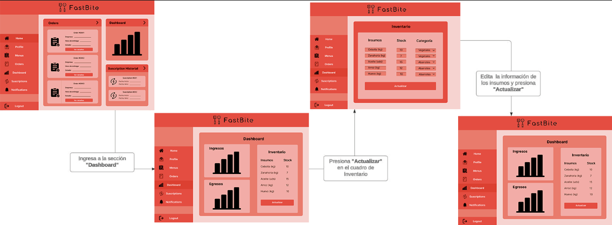

# Chapter IV: Product Design
---
## 4.1. Style Guidelines.

## 4.1.1. General Style Guidelines.

En este apartado, se mostrará de manera organizada los estilos y herramientas que se usarán para diseñar nuestra solución.

**Brand Overview**

FastBite es una plataforma diseñada para simplificar el proceso de pedidos de almuerzos para empresas. Nuestro objetivo es ofrecer una experiencia de usuario fluida y conveniente tanto para los administradores de empresas como para los restaurantes asociados, asegurando que los empleados reciban comidas deliciosas y nutritivas en el lugar de trabajo.

**Brand Name**

FastBite utiliza "Fast" (rápido) y "Bite" (bocado) en su nombre para transmitir de manera precisa la experiencia y beneficios que ofrece la aplicación. Fast (Rápido) representa la velocidad y eficiencia del servicio que FastBite proporciona. La aplicación permite a los usuarios realizar pedidos de comida de forma rápida y sencilla, agilizando el proceso de selección, pago y entrega. Por otro lado, Bite (Bocado) evoca la idea de disfrutar de una comida deliciosa y satisfactoria. FastBite se centra en ofrecer una amplia variedad de opciones culinarias que son sabrosas, frescas y que satisfacen los antojos de los usuarios. Juntos, "FastBite" transmite la idea de una experiencia culinaria conveniente, rápida y deliciosa, donde los usuarios pueden disfrutar de bocados deliciosos sin tener que esperar mucho tiempo ni complicarse con procesos largos.

A continuacion, se presenta el logo:

**Typography**

La elección de la tipografía Montserrat en FastBite se basa en su capacidad para mejorar la legibilidad y la comprensión del contenido en todas las secciones de nuestra interfaz. Esta tipografía se utiliza en cuatro niveles distintos: encabezados, cuerpo de texto, botones y enlaces. Su estilo amigable y fácil de leer ayuda a los usuarios a navegar por nuestras páginas de manera intuitiva y atractiva, guiándolos de forma efectiva a través de la experiencia de usuario.

**Colors**

La gama de colores seleccionada para la app FastBite se basa en la psicología del color y en la transmisión de emociones y sensaciones específicas para mejorar la experiencia del usuario:

- Rojo: El rojo se asocia comúnmente con la energía, la pasión y el apetito. En FastBite, el color rojo se utiliza estratégicamente para resaltar elementos importantes como botones de acción, promociones y notificaciones, creando un sentido de urgencia y atrayendo la atención del usuario de manera efectiva.

- Naranja: El naranja es un color cálido y enérgico que evoca la felicidad y la creatividad. En la app, el naranja se utiliza para destacar características positivas y aspectos alegres, como ofertas especiales, opciones de menú destacadas o mensajes de satisfacción del cliente.

- Rosado: El rosa es un color suave y relajante que se asocia con la ternura, la amabilidad y la dulzura. En FastBite, el color rosa puede utilizarse para resaltar información importante pero de manera amigable, como políticas de la empresa, términos y condiciones, o mensajes de bienvenida.

- Blanco: El blanco se relaciona con la claridad, la simplicidad y la limpieza. Es utilizado en FastBite para espacios de respiración, fondos neutros y áreas donde se desea enfocar la atención del usuario sin distracciones visuales.

- Gris: El gris es un color neutral que transmite profesionalismo, estabilidad y modernidad. En la app, el gris se utiliza para elementos secundarios como barras de navegación, fondos de texto y otros elementos que complementan la paleta de colores principal sin competir por la atención del usuario.

En conjunto, esta gama de colores en FastBite busca crear una experiencia visual equilibrada y atractiva, que capte la atención del usuario de manera efectiva, transmita la personalidad y valores de la marca, y mejore la usabilidad y comprensión de la interfaz.

**Tono de lenguaje de comunicación y lenguaje aplicado**

En FastBite, utilizamos un tono amigable y cercano, comunicando de manera clara y concisa para mantener un nivel de profesionalismo adecuado, persuadir a los usuarios de manera empática y aplicar un lenguaje claro y sencillo que sea accesible para todos los usuarios, adaptándonos al contexto según sea necesario.

## 4.1.2. Web Style Guidelines.

Vamos a desarrollar un sitio web responsive que se ajuste automáticamente a cualquier dispositivo para garantizar una experiencia de usuario sin interrupciones, manteniendo la claridad y estética visual en todas las resoluciones comunes utilizadas en dispositivos actuales, asegurando así una adaptabilidad óptima en todo momento.

## 4.2. Information Architecture.

## 4.2.1. Organization Systems.

Sistema Organizacional de FastBite
1. Desarrollo de Producto

- Equipo de Desarrollo
- Equipo de Pruebas

2. Diseño y Experiencia de Usuario (UX/UI)

- Equipo de Diseño

3. Marketing y Comunicaciones

- Equipo de Marketing
- Equipo de Redes Sociales

4. Operaciones y Logística

- Equipo de Entrega
- Equipo de Atención al Cliente

5. Finanzas y Administración

- Equipo Financiero
- Equipo de Recursos Humanos

6. Equipo Ejecutivo

- CEO y Directores
- Gerentes de Departamento

Este sistema organizacional simplificado refleja las principales áreas funcionales de FastBite y cómo están estructuradas para garantizar una operación eficiente y efectiva.

## 4.2.2. Labeling Systems.

1. Etiquetas de Categoría de Comida:

- Desayuno
- Almuerzo
- Cena
- Snacks

2. Etiquetas de Preferencias Dietéticas:

- Vegetariano
- Vegano
- Sin Gluten
- Bajo en Carbohidratos

3. Etiquetas de Popularidad:

- Más Vendido
- Nuevos Platos
- Ofertas Especiales 
- Recomendado

4. Etiquetas de Estado del Pedido:

- Pendiente
- En Preparación
- En Camino
- Entregado

5. Etiquetas de Valoración:

- 5 Estrellas
- 4 Estrellas
- 3 Estrellas
- 2 Estrellas
- 1 Estrella

6. Etiquetas de Temporada:

- Verano 
- Otoño
- Invierno
- Primavera
   
Este sistema de etiquetado se enfoca en categorizar y clasificar los elementos dentro de FastBite para facilitar la navegación y búsqueda de los usuarios, mejorando así la experiencia general de uso de la aplicación.

## 4.2.3. SEO Tags and Meta Tags
***Landing Page:***

**Title:** Devinsons - Descubre FastBite: La Plataforma para Pedidos Corporativos
**Description:** Devinsons es la plataforma líder en pedidos corporativos para empresas. Con FastBite, simplificamos el proceso de pedidos de almuerzos para tus empleados. ¡Descubre cómo mejorar la experiencia de alimentación de tu equipo hoy mismo!
**Keywords:** Devinsons, FastBite, pedidos corporativos, plataforma de pedidos, almuerzos para empresas, comida corporativa, pedidos de almuerzo, alimentación de empleados
**Author:** Devinsons Team

***Página de la Aplicación Web (FastBite):***

**Title:** FastBite - Plataforma de Pedidos Corporativos
**Description:** Bienvenido a FastBite, la plataforma de pedidos corporativos que simplifica la forma en que las empresas gestionan los almuerzos de sus empleados. Encuentra menús diarios, realiza pedidos y gestiona tus opciones de alimentación con facilidad.
**Keywords:** FastBite, plataforma de pedidos corporativos, pedidos de almuerzo para empresas, menús diarios, gestión de alimentación corporativa
**Author:** Devinsons Team
## 4.2.4. Searching Systems.

Búsqueda de Restaurantes:

Esta función permite a los usuarios buscar rápidamente restaurantes cercanos y de confianza. Los usuarios podran visualizar los restaurantes con mejores calificaciones primero. Además, tienen la opción de ordenar la lista de acuerdo a los filtros seleccionados

## 4.2.5. Navigation Systems.

En el navigation system ayudaremos al usuario navegar libremente en nuestra web con diversas interfaces diseñadas:

Navegacion: Acceso a las opciones de la web

Estos botones se encuentran en el lado izquierdo de la pantalla para que el usuario pueda visualizar y utilizar las diversas opciones que se desarrollaron.

## 4.3. Landing Page UI Design.

## 4.3.1. Landing Page Wireframe.
En esta sección se mostrará una representación de bajo nivel de la landing page.[link de wireframe](https://www.figma.com/file/fp9TggWKgnPcDyMw6CtjcM/FastBITE?type=design&node-id=1%3A292&mode=design&t=2AWNbuoKspwpadXU-1)

**Landing Page para Desktop Web Browser:**

**Mobile Web Browser:**
Aqui se mostrara un esquema a bajo nivel de la version mobile, cumpliendo con la regla de ser responsive.

## 4.3.2. Landing Page Mock-up.
En esta sección se mostrará la landing page haciendo uso de la tipografía, colores y etiquetas,previamente documentada. [link de Mockup](https://www.figma.com/file/fp9TggWKgnPcDyMw6CtjcM/FastBITE?type=design&node-id=1%3A292&mode=design&t=2AWNbuoKspwpadXU-1)

## 4.4. Web Applications UX/UI Design.

## 4.4.1. Web Applications Wireframes.

En esta sección se presentarán los wireframes diseñados para nuestra aplicación, los cuales son bocetos en escala de grises que brindan una representación de baja fidelidad de cómo funcionará la aplicación. Además, hay que destacar que estos wireframes fueron realizados en Figma y puede acceder a estos mediante el siguiente link: [Figma - Wireframes - FastBite](https://www.figma.com/file/7QgzTUZif5vpC0IRewq9G8/FastBite---Open-Source?type=design&node-id=0%3A1&mode=design&t=w5Zj7bBvjfNfSX0j-1)

**Interfaz de registro e ingreso de usuarios**

**Interfaces para recuperar contraseña**

**Interfaz para obtener suscripción**

**Interfaces de administradores de empresas**

**Interfaces de administrador de empresa para generar un pedido**

**Interfaces de administrador de restaurantes**

**Interfaces de administradores de restaurantes para atender un pedido**

**Interfaces de administradores de restaurantes para generar un menú**

**Interfaces de administradores de restaurantes para gestionar inventario**

## 4.4.2. Web Applications Wireflow Diagrams.

### Usuarios:

* **User goal:** Como usuario quiero registrarme en la aplicación web para acceder a las funcionalidades que ofrece

* **User goal:** Como usuario quiero iniciar sesión con mi correo y contraseña para acceder a la plataforma

* **User goal:** Como usuario quiero poder restablecer mi contraseña a través de una verificación desde mi correo para garantizar la seguridad de mi cuenta

### Administradores de empresa:

* **User Goal:** Como usuario, necesito la capacidad de actualizar fácilmente mis datos de perfil para garantizar que la información asociada con mi cuenta esté siempre actualizada y precisa.

* **User Goal:** Como administrador de la empresa suscrita, quiero poder acceder al catálogo de menús diarios proporcionados por los restaurantes afiliados, para seleccionar fácilmente los almuerzos que se ofrecerán a los empleados

* **User Goal:** Como administrador de la empresa suscrita, quiero poder realizar pedidos de almuerzos en nombre de los empleados y programar la entrega de los mismos

* **User Goal:** Como administrador de la empresa suscrita, quiero poder acceder a un historial completo de pedidos realizados, para tener un registro de las órdenes hechas a cada restaurante y fechas correspondientes

### Administradores de Restaurantes: 

* **User Goal:** Como administrador del restaurante afiliado, quiero tener la capacidad de actualizar rápidamente el menú diario en la plataforma, para garantizar que los clientes corporativos tengan acceso a información actualizada sobre las opciones de almuerzo.

* **User Goal:** Como administrador del restaurante afiliado, quiero tener un registro dentro plataforma donde pueda ver un resumen de todos los pedidos recibidos, incluido su estado actual (pendiente, en preparación, entregado), para facilitar la gestión y seguimiento de los pedidos.

* **User Goal:** Como administrador del restaurante afiliado, quiero poder acceder a gráficos y análisis que muestran las métricas clave de mi negocio para tomar decisiones informadas respecto al restaurante.

* **User Goal:** Como administrador del restaurante afiliado, quiero poder registrar nuevos insumos y productos en el sistema, incluyendo detalles como nombre, cantidad disponible y fecha de vencimiento, para mantener un registro preciso del inventario.

## 4.4.2. Web Applications Mock-ups.

**Interfaz de registro e ingreso de usuarios**

**Interfaces para recuperar contraseña**

**Interfaz para obtener suscripción**

**Interfaces de administradores de empresas**

**Interfaces de administrador de empresa para generar un pedido**

**Interfaces de administrador de restaurantes**

**Interfaces de administradores de restaurantes para atender un pedido**

**Interfaces de administradores de restaurantes para generar un menú**

**Interfaces de administradores de restaurantes para gestionar inventario**

## 4.4.3. Web Applications User Flow Diagrams.

### Usuarios:

* **User goal:** Como usuario quiero registrarme en la aplicación web para acceder a las funcionalidades que ofrece

* **User goal:** Como usuario quiero iniciar sesión con mi correo y contraseña para acceder a la plataforma

* **User goal:** Como usuario quiero poder restablecer mi contraseña a través de una verificación desde mi correo para garantizar la seguridad de mi cuenta

### Administradores de empresa:

* **User Goal:** Como usuario, necesito la capacidad de actualizar fácilmente mis datos de perfil para garantizar que la información asociada con mi cuenta esté siempre actualizada y precisa.

* **User Goal:** Como administrador de la empresa suscrita, quiero poder acceder al catálogo de menús diarios proporcionados por los restaurantes afiliados, para seleccionar fácilmente los almuerzos que se ofrecerán a los empleados

* **User Goal:** Como administrador de la empresa suscrita, quiero poder realizar pedidos de almuerzos en nombre de los empleados y programar la entrega de los mismos

* **User Goal:** Como administrador de la empresa suscrita, quiero poder acceder a un historial completo de pedidos realizados, para tener un registro de las órdenes hechas a cada restaurante y fechas correspondientes

### Administradores de Restaurantes:

* **User Goal:** Como administrador del restaurante afiliado, quiero tener la capacidad de actualizar rápidamente el menú diario en la plataforma, para garantizar que los clientes corporativos tengan acceso a información actualizada sobre las opciones de almuerzo.

* **User Goal:** Como administrador del restaurante afiliado, quiero tener un registro dentro plataforma donde pueda ver un resumen de todos los pedidos recibidos, incluido su estado actual (pendiente, en preparación, entregado), para facilitar la gestión y seguimiento de los pedidos.

* **User Goal:** Como administrador del restaurante afiliado, quiero poder acceder a gráficos y análisis que muestran las métricas clave de mi negocio para tomar decisiones informadas respecto al restaurante.

* **User Goal:** Como administrador del restaurante afiliado, quiero poder registrar nuevos insumos y productos en el sistema, incluyendo detalles como nombre, cantidad disponible y fecha de vencimiento, para mantener un registro preciso del inventario.

## 4.5. Web Applications Prototyping.

Link del video: https://upcedupe-my.sharepoint.com/:v:/g/personal/u202117498_upc_edu_pe/EVEvKhHNRvFMkYYfcum-LmYB32QBR35DKX4RtnD9Nmx9Dw?nav=eyJyZWZlcnJhbEluZm8iOnsicmVmZXJyYWxBcHAiOiJPbmVEcml2ZUZvckJ1c2luZXNzIiwicmVmZXJyYWxBcHBQbGF0Zm9ybSI6IldlYiIsInJlZmVycmFsTW9kZSI6InZpZXciLCJyZWZlcnJhbFZpZXciOiJNeUZpbGVzTGlua0NvcHkifX0&e=1lEg3f
Link del Prototipo: https://www.figma.com/proto/muGyKMW5uIO9tiJVWyjcwX/FastBite---Open-Source-Web-Application-MockUps-(Copy)?type=design&node-id=8-435&t=23pK08wrhqiIg8qc-1&scaling=min-zoom&page-id=0%3A1&starting-point-node-id=1%3A2&mode=design 

## 4.6. Domain-Driven Software Architecture.

## 4.6.1. Software Architecture Context Diagram.

**System Context Diagram:**

## 4.6.2. Software Architecture Container Diagrams.

**Container Diagram:**

## 4.6.3. Software Architecture Components Diagrams.

**Tracking Component Diagram:**

**Sales Component Diagram:**

**Payments Component Diagram:**

**Authentication Component Diagram:**

## 4.7. Software Object-Oriented Design.

## 4.7.1. Class Diagrams.

## 4.7.2. Class Dictionary.
En esta seccion se exlicara las clases que usamos en el diagrama.
 **User:** representa a nuestros 2 usuarios: Restaurantes y empresas.
 **SuscriptionType:** define los tipos de suscripciones que tenemos.
 **Restaurant:** se implementan las funcionalidades que tendria el restaurante, logica de las funciones que tendria el restaurante
 **Company:** se define las funcionalidades de realizar pedios.
 **StatisticsManager:** logica de las estadisticas que se usaran el el front-end
 **InventoryControl:** se manejara el controll de inventario como actualizacion y agregacion de los productos
 **OrderManager:** recivira las pedidos y notificara los cambios de estado de ellos.
 **MenuCatalog:** La logica de actualizacion del menu del catalogo
 **Menu:** Se listara los productos que tengas en el menu
 **Product:** definicion de los atributos de un producto
 **Order:** Logica de orden, como el tiempo del delivery y el registro de la orden.
 **Paymant:** logica de las transacciones financieras

## 4.8. Database Design.

## 4.8.1. Database Diagram.

**Link del diagrama en Vertabelo:**  [Ver este enlace](https://my.vertabelo.com/public-model-view/X6j4QYoZ4DVeJRBLYz5yORiwSh84oJ2mZyCudAcbpnwJ386s3xdeVvLKJGZyDsL7?x=1042&y=2674&zoom=0.70)
