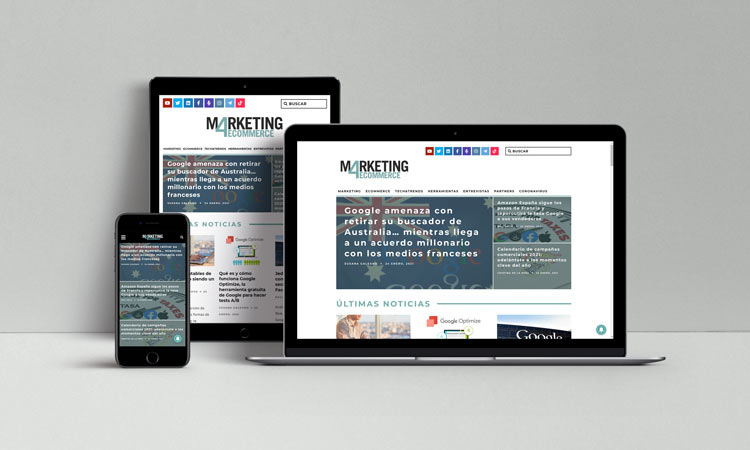

# Chapter IV: Product Design
---
## 4.1. Style Guidelines.

## 4.1.1. General Style Guidelines.

En este apartado, se mostrará de manera organizada los estilos y herramientas que se usarán para diseñar nuestra solución.

**Brand Overview**

FastBite es una plataforma diseñada para simplificar el proceso de pedidos de almuerzos para empresas. Nuestro objetivo es ofrecer una experiencia de usuario fluida y conveniente tanto para los administradores de empresas como para los restaurantes asociados, asegurando que los empleados reciban comidas deliciosas y nutritivas en el lugar de trabajo.

**Brand Name**

FastBite utiliza "Fast" (rápido) y "Bite" (bocado) en su nombre para transmitir de manera precisa la experiencia y beneficios que ofrece la aplicación. Fast (Rápido) representa la velocidad y eficiencia del servicio que FastBite proporciona. La aplicación permite a los usuarios realizar pedidos de comida de forma rápida y sencilla, agilizando el proceso de selección, pago y entrega. Por otro lado, Bite (Bocado) evoca la idea de disfrutar de una comida deliciosa y satisfactoria. FastBite se centra en ofrecer una amplia variedad de opciones culinarias que son sabrosas, frescas y que satisfacen los antojos de los usuarios. Juntos, "FastBite" transmite la idea de una experiencia culinaria conveniente, rápida y deliciosa, donde los usuarios pueden disfrutar de bocados deliciosos sin tener que esperar mucho tiempo ni complicarse con procesos largos.

A continuacion, se presenta el logo:

**Typography**

La elección de la tipografía Montserrat en FastBite se basa en su capacidad para mejorar la legibilidad y la comprensión del contenido en todas las secciones de nuestra interfaz. Esta tipografía se utiliza en cuatro niveles distintos: encabezados, cuerpo de texto, botones y enlaces. Su estilo amigable y fácil de leer ayuda a los usuarios a navegar por nuestras páginas de manera intuitiva y atractiva, guiándolos de forma efectiva a través de la experiencia de usuario.

**Colors**

La gama de colores seleccionada para la app FastBite se basa en la psicología del color y en la transmisión de emociones y sensaciones específicas para mejorar la experiencia del usuario:

- Rojo: El rojo se asocia comúnmente con la energía, la pasión y el apetito. En FastBite, el color rojo se utiliza estratégicamente para resaltar elementos importantes como botones de acción, promociones y notificaciones, creando un sentido de urgencia y atrayendo la atención del usuario de manera efectiva.

- Naranja: El naranja es un color cálido y enérgico que evoca la felicidad y la creatividad. En la app, el naranja se utiliza para destacar características positivas y aspectos alegres, como ofertas especiales, opciones de menú destacadas o mensajes de satisfacción del cliente.

- Rosado: El rosa es un color suave y relajante que se asocia con la ternura, la amabilidad y la dulzura. En FastBite, el color rosa puede utilizarse para resaltar información importante pero de manera amigable, como políticas de la empresa, términos y condiciones, o mensajes de bienvenida.

- Blanco: El blanco se relaciona con la claridad, la simplicidad y la limpieza. Es utilizado en FastBite para espacios de respiración, fondos neutros y áreas donde se desea enfocar la atención del usuario sin distracciones visuales.

- Gris: El gris es un color neutral que transmite profesionalismo, estabilidad y modernidad. En la app, el gris se utiliza para elementos secundarios como barras de navegación, fondos de texto y otros elementos que complementan la paleta de colores principal sin competir por la atención del usuario.

En conjunto, esta gama de colores en FastBite busca crear una experiencia visual equilibrada y atractiva, que capte la atención del usuario de manera efectiva, transmita la personalidad y valores de la marca, y mejore la usabilidad y comprensión de la interfaz.

**Tono de lenguaje de comunicación y lenguaje aplicado**

En FastBite, utilizamos un tono amigable y cercano, comunicando de manera clara y concisa para mantener un nivel de profesionalismo adecuado, persuadir a los usuarios de manera empática y aplicar un lenguaje claro y sencillo que sea accesible para todos los usuarios, adaptándonos al contexto según sea necesario.

## 4.1.2. Web Style Guidelines.

Vamos a desarrollar un sitio web responsive que se ajuste automáticamente a cualquier dispositivo para garantizar una experiencia de usuario sin interrupciones, manteniendo la claridad y estética visual en todas las resoluciones comunes utilizadas en dispositivos actuales, asegurando así una adaptabilidad óptima en todo momento.

## 4.2. Information Architecture.

## 4.2.1. Organization Systems.

Sistema Organizacional de FastBite
1. Desarrollo de Producto

- Equipo de Desarrollo
- Equipo de Pruebas

2. Diseño y Experiencia de Usuario (UX/UI)

- Equipo de Diseño

3. Marketing y Comunicaciones

- Equipo de Marketing
- Equipo de Redes Sociales

4. Operaciones y Logística

- Equipo de Entrega
- Equipo de Atención al Cliente

5. Finanzas y Administración

- Equipo Financiero
- Equipo de Recursos Humanos

6. Equipo Ejecutivo

- CEO y Directores
- Gerentes de Departamento

Este sistema organizacional simplificado refleja las principales áreas funcionales de FastBite y cómo están estructuradas para garantizar una operación eficiente y efectiva.

## 4.2.2. Labeling Systems.

1. Etiquetas de Categoría de Comida:

- Desayuno
- Almuerzo
- Cena
- Snacks

2. Etiquetas de Preferencias Dietéticas:

- Vegetariano
- Vegano
- Sin Gluten
- Bajo en Carbohidratos

3. Etiquetas de Popularidad:

- Más Vendido
- Nuevos Platos
- Ofertas Especiales 
- Recomendado

4. Etiquetas de Estado del Pedido:

- Pendiente
- En Preparación
- En Camino
- Entregado

5. Etiquetas de Valoración:

- 5 Estrellas
- 4 Estrellas
- 3 Estrellas
- 2 Estrellas
- 1 Estrella

6. Etiquetas de Temporada:

- Verano 
- Otoño
- Invierno
- Primavera
   
Este sistema de etiquetado se enfoca en categorizar y clasificar los elementos dentro de FastBite para facilitar la navegación y búsqueda de los usuarios, mejorando así la experiencia general de uso de la aplicación.

## 4.2.3. SEO Tags and Meta Tags

## 4.2.4. Searching Systems.

Búsqueda de Restaurantes:

Esta función permite a los usuarios buscar rápidamente restaurantes cercanos y de confianza. Los usuarios podran visualizar los restaurantes con mejores calificaciones primero. Además, tienen la opción de ordenar la lista de acuerdo a los filtros seleccionados

## 4.2.5. Navigation Systems.

En el navigation system ayudaremos al usuario navegar libremente en nuestra web con diversas interfaces diseñadas:

Navegacion: Acceso a las opciones de la web

Estos botones se encuentran en el lado izquierdo de la pantalla para que el usuario pueda visualizar y utilizar las diversas opciones que se desarrollaron.

## 4.3. Landing Page UI Design.

## 4.3.1. Landing Page Wireframe.
En esta sección se mostrará una representación de bajo nivel de la landing page.[link de wireframe](https://www.figma.com/file/fp9TggWKgnPcDyMw6CtjcM/FastBITE?type=design&node-id=1%3A292&mode=design&t=2AWNbuoKspwpadXU-1)

**Landing Page para Desktop Web Browser:**

**Mobile Web Browser:**
Aqui se mostrara un esquema a bajo nivel de la version mobile, cumpliendo con la regla de ser responsive.

## 4.3.2. Landing Page Mock-up.
En esta sección se mostrará la landing page haciendo uso de la tipografía, colores y etiquetas,previamente documentada. [link de Mockup](https://www.figma.com/file/fp9TggWKgnPcDyMw6CtjcM/FastBITE?type=design&node-id=1%3A292&mode=design&t=2AWNbuoKspwpadXU-1)

## 4.4. Web Applications UX/UI Design.

## 4.4.1. Web Applications Wireframes.

## 4.4.2. Web Applications Wireflow Diagrams.

## 4.4.2. Web Applications Mock-ups.

## 4.4.3. Web Applications User Flow Diagrams.

## 4.5. Web Applications Prototyping.

## 4.6. Domain-Driven Software Architecture.

## 4.6.1. Software Architecture Context Diagram.

**System Context Diagram:**

## 4.6.2. Software Architecture Container Diagrams.

## 4.6.3. Software Architecture Components Diagrams.

## 4.7. Software Object-Oriented Design.

## 4.7.1. Class Diagrams.

## 4.7.2. Class Dictionary.
En esta seccion se exlicara las clases que usamos en el diagrama.
 **User:** representa a nuestros 2 usuarios: Restaurantes y empresas.
 **SuscriptionType:** define los tipos de suscripciones que tenemos.
 **Restaurant:** se implementan las funcionalidades que tendria el restaurante, logica de las funciones que tendria el restaurante
 **Company:** se define las funcionalidades de realizar pedios.
 **StatisticsManager:** logica de las estadisticas que se usaran el el front-end
 **InventoryControl:** se manejara el controll de inventario como actualizacion y agregacion de los productos
 **OrderManager:** recivira las pedidos y notificara los cambios de estado de ellos.
 **MenuCatalog:** La logica de actualizacion del menu del catalogo
 **Menu:** Se listara los productos que tengas en el menu
 **Product:** definicion de los atributos de un producto
 **Order:** Logica de orden, como el tiempo del delivery y el registro de la orden.
 **Paymant:** logica de las transacciones financieras

## 4.8. Database Design.

## 4.8.1. Database Diagram.

**Link del diagrama en Vertabelo:**  [Ver este enlace](https://my.vertabelo.com/public-model-view/X6j4QYoZ4DVeJRBLYz5yORiwSh84oJ2mZyCudAcbpnwJ386s3xdeVvLKJGZyDsL7?x=1042&y=2674&zoom=0.70)
