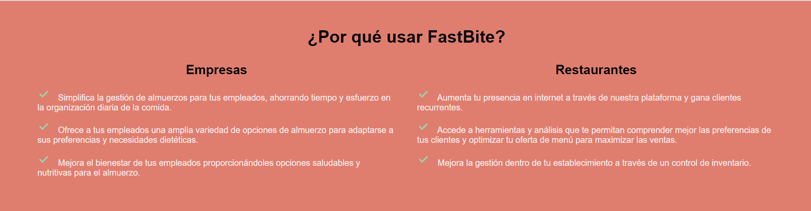

# Capítulo V: Product Implementation, Validation & Deployment.
## 5.1. Software Configuration Management.
### 5.1.1. Software Development Environment Configuration.

En este apartado se indicará los nombres de todos los productos de software a utilizar durante el desarrollo del proyecto, así como las rutas de referencia o descarga de estas. 

Para ello, se organizará la información considerando el tipo de actividades realizadas durante el ciclo de vida del proyecto, siendo la estructura de esta forma:

**Project Management**

* **Scrum Framework:** Este es un marco de trabajo para gestionar proyectos enfocados en el desarrollo ágil de productos software. Implementar este framework en nuestro proyecto nos ayudará a coordinar eficientemente el trabajo en equipo. Puedes obtener más información sobre Scrum mediante [este enlace](https://aws.amazon.com/es/what-is/scrum/).

**Requirements Management**

* **Pivotal Tracker:** Esta es una herramienta online que nos permite gestionar fácilmente nuestras historias de usuarios, mediante la creación de Epics. Además, nos permitió desarrollar el Product Backlog asignando puntos de priorización de cada historia de usuario, para que durante el desarrollo de la aplicación, nos enfoquemos primero en las mejor puntuadas y dejar las más sencillas para el final. Puedes utilizar la herramienta Pivotal Tracker mediante [este enlace](https://www.pivotaltracker.com).

**Product UX/UI Design**

* **UXpressia:** Esta es una plataforma digital que nos ofrece plantillas para crear artefactos de nuestros segmentos objetivos como User Personas, Empathy Maps, Impact Maps y Journey Maps. Puedes utilizar las herramientas que ofrece UXpressia mediante [este enlace](https://uxpressia.com).

* **Miro**: Esta es una plataforma digital que ofrece un entorno para realizar trabajos colaborativos, como lluvia de ideas, tablas y diagramas. Se utilizó esta plataforma para diseñar los cuadros As-Is y To-Be Scenary Map de nuestros segmentos objetivos. Para acceder a las herramientas que ofrece Miro [este enlace](https://miro.com/es/).

* **Figma**: Esta es una herramienta online que ofrece el servicio de maquetación y prototipado de Landing pages,  aplicaciones web, móviles y de escritorio. Esto nos permite tener una estimación de cómo debería funcionar nuestro proyecto. Puedes acceder al servicio que ofrece Figma mediante [este enlace](https://www.figma.com).

* **LucidChart:** Esta es una herramienta de diagramación online que nos permite trabajar colaborativamente en tiempo real. La herramienta ofrece plantillas para crear diagramas de flujo, diagramas UML, etc. En nuestro caso, utilizamos esta herramienta para realizar los Wireflow Diagrams y Userflow Diagrams. Puedes utilizar la herramienta LucidChart mediante [este enlace](https://lucid.app/pricing/lucidchart#/pricing/chart)


**Software Development**

* **GitHub:** Esta es una plataforma digital donde se pueden alojar proyectos mediante repositorios, los cuales utilizan un sistema de control de versiones llamado Git. GitHub nos permite trabajar colaborativamente y tener un seguimiento detallado de los avances en el proyecto. Para acceder a nuestro repositorio utiliza [este enlace](https://github.com/Cyber-Savants).

* **Git:** Este es un software de control de versiones el cual se instala localmente y nos permite tener un historial de cambios que se realizan en el proyecto mediante commits. También se utiliza para trabajar colaborativamente en repositorios que se encuentran subidos en GitHub. Para descargar Git utiliza [este enlace](https://git-scm.com).

* **WebStorm:** Este es un entorno de desarrollo, el cual nos permite trabajar con HTML, CSS, Javascript y con frameworks como Vue y Angular. Para obtener WebStorm utiliza [este enlace](https://www.jetbrains.com/es-es/webstorm/).

* **IntelliJ:** Este es un entorno de desarrollo, el cual nos permite trabajar con el lenguaje Java y Kotlin para desarrollar aplicaciones de escritorio, web, moviles y webservices mediante el framework SpringBoot. Para obtener IntelliJ utiliza [este enlace](https://www.jetbrains.com/idea).

**Software Testing**

* **Gherkin:** Este es un lenguaje DSL (Domain Specific Language), que nos permite abordar problemas específicos. Esto lo utilizamos para los criterios de aceptación de las historias de usuario de nuestro proyecto. Puedes conocer más sobre Gherkin mediante [este enlace](https://profile.es/blog/que-es-gherkin/).

**Software Deployment**

* **GitHub Pages:** Este es un servicio que ofrece GitHub para publicar un sitio web a partir de un repositorio, cabe destacar que solo permite alojar sitios web estáticos con archivos HTML, CSS y JavaScript. Puedes aprender a como usar este servicio mediante [este enlace](https://pages.github.com).

**Software Documentation**

* **Markdown:** Este es un lenguaje de marcado ligero, el cual nos permite documentar proyectos. En cuanto a nosotros, utilizamos este lenguaje para redactar el informe de nuestro proyecto y en los archivos README en el repositorio de la organización. Puedes aprender Markdown mediante [este enlace](https://markdown.es/sintaxis-markdown/).

### 5.1.2. Source Code Management.

En esta sección se detalla qué medios se utilizaron para el seguimiento de las modificaciones, así como la semántica y nomenclatura que se usará para los commits y releases que se implementarán durante el avance del proyecto.

Antes que nada, hay que mencionar que se utilizará GitHub como sistema de control de versiones del informe, landing page, web service y frontend de nuestro proyecto. Para ello se crearon sus respectivos repositorios:

* Url de la organización: [github.com/Devinsons](https://github.com/Devinsons)
* Repositorio Landing page: [github.com/Devinsons/FastBite-LandingPage](https://github.com/Devinsons/FastBite-LandingPage)

**GitFlow:**

Git Flow es un modelo de trabajo el cual consta de ramas principales y ramas de apoyo. Decidimos utilizar este modelo ya que nos permite mantener el código de nuestro proyecto limpio y ordenado al dividirlo en ramas, de tal forma que nos facilita trabajar colaborativamente. Además, lo que hace eficiente a GitFlow es que presenta una gran variedad de ramas, las cuales son:

* **Ramas Principales:**
    * **Main:** Esta es la rama principal desde donde se ramifican todas las demás. Además, contiene el código fuente que está listo para producción y cada cambio que se realice en esta se consideraría como una nueva versión del proyecto
    * **Develop:** Esta rama surge a partir de la rama Main y se utiliza para integrar las funcionalidades trabajadas en las ramas posteriores. Aquí se acopla todo el código que está listo para pasar a la rama Main y crear una nueva versión (Release) de nuestro proyecto.

* **Ramas de Apoyo:**

    * **Feature:** Estas son ramas creadas a partir Develop y se crean tantas como funcionalidades presenta nuestro proyecto. Una vez se termina de trabajar en estas ramas, deben fusionarse con la rama Develop para posteriormente ser eliminada. La nomenclatura que se utiliza es la siguiente:

            feature/benefits
            feature/profile
            feature/memberships

    * **Release:** Estas son ramas creadas a partir de Develop y sirven para preparar una nueva versión de nuestro proyecto que está listo para publicar. Cabe destacar que, en caso se requiera agregar nuevas funcionalidades, se tendrá que crear otra rama Release siguiendo las normas del Semantic Versioning 2.0.0, la cual se explicará más adelante.

    * **Hotfix:** Estas ramas son creadas a partir del Main y sirven para corregir rápidamente los errores que se presentan en el código publicado en esa rama (Main). Cabe destacar que una vez corregido el error, las ramas Hotfix deben fusionarse con las ramas Main y Develop.


**Semantic Versioning**

Este es un conjunto de reglas que nos permitirán gestionar correctamente la numeración de versiones de nuestro proyecto, para ello lo implementaremos en las ramas Release siguiendo el formato X.Y.Z (Major, Minor, Patch)

* **Versión de Parche (Z):** Se incrementa solo si se implementan correcciones compatibles con versiones anteriores.

* **Versión Secundaria (Y):** Se incrementa cuando se agregan nuevas funcionalidades que son compatibles con versiones anteriores.

* **Versión Principal (X):** Se incrementa cuando los cambios agregados no son compatibles con las versiones anteriores. Cabe destacar que al incrementar este parámetro, la enumeración de los parámetros Y y Z se inicializan en 0.

        release-1.0.5
        release-2.1.3
        release-2.2.1

**Conventional Commits**

Este es un conjunto de reglas, las cuales deben seguir nuestros commits para crear un historial explícito de los cambios realizados en el proyecto, haciéndolo más sencillo de comprender para el equipo de desarrollo. Los conventional commits siguen la siguiente estructura: 

    <type> [opcional scope]: <description>
    [optional body]
    [optional footer]

* **type:** Dependiendo del cambio que se realicen en el proyecto, los commits pueden ser:
    * **feat:** Cuando se agrega una nueva funcionalidad (feature)
    * **docs:** Cuando se realizan cambios en la documentación del proyecto
    * **fix:** Cuando se corrige un error en el código
    * **chore**: Cuando se realizan cambios que no afectan al código
    * **refactor:** Cuando se realizan cambios es la estructura del código, sin afectar al comportamiento del proyecto
    * **build**: Cuando se realizan cambios en los componentes del proyecto, como dependencias externas.
    * **perf:** Cuando se realizan cambio que mejoran el rendimiento del proyecto
* **scope:** Este es un campo opcional, que nos permite especificar el alcance que tiene el commit.
* **description:** Este es un campo obligatorio, ya que proporciona información breve y concisa de los cambios que se han realizado. Además debe ser escrito en minúsculas y de modo imperativo
* **body:** Este es un campo opcional en el cual se detalla más información sobre el commit, como el motivo del cambio. 
* **footer:** Este es un campo opcion y se utiliza para informar respecto a cambios importantes en el proyecto

### 5.1.3. Source Code Style Guide & Conventions.

**Nomenclatura General**

Para los nombres de variables, objetos, elementos y funciones no se utilizarán mayúsculas en estos nombres, ya que, de acuerdo con W3Schools (sin fecha), puesto que la combinación entre mayúsculas y minúsculas puede dificultar la legibilidad del código.

Ejemplos de nomenclatura estándar, siguiendo las recomendaciones de Google (s.f.):

```
.gallery {}
.video {}
.login {}
```

**Sangría**

Al trabajar con HTML, CSS y/o JavaScript, se aplicará un espaciado de dos espacios antes de cada línea que se encuentre dentro de un bloque. Según W3Schools (sin fecha), no se recomienda el uso de la tecla "Tabulación". 

Ejemplo de nomenclatura estándar de la sangría HTML según W3Schools(s.f):
``` html
<!DOCTYPE html>
<html>
  <head>
    <title>Título</title>
  </head>
  <body>
    <h1>Encabezado</h1>
    <p>Párrafo.</p>
  </body>
</html>
```


Ejemplo de formato estándar de sangría en CSS según W3Schools (s.f):

``` CSS
html {
  background: #fff; /* Fondo blanco */
  color: #404;     /* Color de texto gris */
}
```

Ejemplo de nomenclatura estándar de la sangría en JavaScript según W3School (s.f.):

``` JavaScript
function toCelsius(fahrenheit) {
  return (5 / 9) * (fahrenheit - 32);
}
```

**HTML:**


HTML, acrónimo de HyperText Markup Language en inglés, es un lenguaje de marcado que se utiliza para definir la estructura de una página web. También incluye funcionalidades que permiten controlar el comportamiento de diferentes elementos del contenido de la página, como cambiar el tamaño del texto o aplicar formato cursiva, entre otros. En nuestro proyecto, emplearemos HTML5, y las pautas a seguir para utilizar este lenguaje de la siguiente manera:

* **Declare Document Type**
La declaración del tipo de documento debe realizarse en la primera línea del código. Según Google (s.f.), se prefiere la sintaxis de HTML5 para todos los documentos HTML. Para declararla, simplemente copia lo siguiente:

``` html
<!DOCTYPE html>
```

* **Blank**
Cada vez que comienza un nuevo bloque, lista o tabla de gran longitud, es recomendable dejar una línea en blanco después del elemento anterior para mejorar la legibilidad y la presentación del código, de acuerdo con las pautas de W3Schools (s.f.).
Ejemplo:

``` html
<body>

<h1>Famous Cities</h1>

<h2>Tokyo</h2>
<p>Tokyo is the capital of Japan, the center of the Greater Tokyo Area, and the most populous metropolitan area in the world.</p>

<h2>London</h2>
<p>London is the capital city of England. It is the most populous city in the United Kingdom.</p>

<h2>Paris</h2>
<p>Paris is the capital of France. The Paris area is one of the largest population centers in Europe.</p>

</body>
```

Esta práctica de dejar una línea en blanco mejora la estructura y legibilidad del código HTML.

* **Quote attribute Values**
Para los valores de los atributos, aunque no sea una caractística obligatoria,es común utilizar comillas dobles alrededor de ellos. Según W3Schools (s.f), esto hace el código más legible y es una práctica común entre los desarrolladores. 
Ejemplo:

``` html
<table class="striped">
```

Este enfoque de usar comillas dobles alrededor de los valores de los atributos es ampliamente aceptado y recomendado en la comunidad de desarrollo web.

* **Never Skip the \<title> Element**
El elemento `<title>` permite que las páginas aparezcan en la lista de resultados al realizar búsquedas en un navegador web. Además, este elemento es responsable de proporcionar el nombre de la página cuando se agrega a marcadores o favoritos.
Ejemplo:

``` html
<title>HTML Style Guide and Coding Conventions</title>
```

Este elemento es esencial para mejorar la identificación y accesibilidad de una página web.

* **HTML Line-Wrapping**
A pesar de que  no exista un límite de palabras por línea en un documento HTML, no se recomienda generar líneas de código excesivamente largas. Para la siguiente línea, se deben utilizar al menos cuatro espacios para distinguir elementos secundarios.
Ejemplo según Google (s.f):

``` html
<button mat-icon-button color='primary' class="menu-button"
(click)="openMenu()">
<mat-icon>menu</mat-icon>
</button>
```


**CSS:**

Conocido así por el acrónimo de su nombre en inglés, Cascading Style Sheets, es un lenguaje que se enfoca en definir y mejorar la presentación de un documento basado en HTML. Las pautas a seguir al utilizar CSS son:

* **Shorthand Properties**
Se debe declarar los campos de los elementos en la menor cantidad de líneas posible, según Google (s.f). esto mejora la eficiencia del código y lo hace más legible. Además, se debe evitar agregar unidades después del valor cero.

Ejemplo segpun Google (s.f):

``` css
border-top: 0;
font: 100%/1.6 palatino, georgia, serif;
padding: 0 1em 2em;
```

* **Declaration**
Es importante incluir un espacio entre el nombre del selector del elemento y la llave que inicia el bloque de CSS. Tambien es necesario incluir un espacio entre los dos puntos que siguen del nombre de una propiedad y su valor correspondiente. Como en la mayoría de lenguajes de programación, debe colocarse punto y coma al final de cada declaración en CSS, según Google (s.f), esta práctica contribuye a mantener la coherencia en el código.

Ejemplo según Google (s.f)

``` css
html {
  background: #fff;
  color: #404;
}
```

* **CSS quotation Marks**
No se deben utilizar comillas dobles (`"`) en el código CSS; en su lugar, se permiten y deben emplearse comillas simples (`'`) únicamente para selectores de atributos y valores de propiedades.
Ejemplo conforme a las pautas estándar de Google (sin fecha):

``` css
html {
  font-family: 'open sans', arial, sans-serif;
}
```

Este ejemplo demuestra el uso de comillas simples para encerrar el valor del atributo `font-family` en CSS, lo cual es una práctica común y aceptada.

**JavaScript**

JavaScript es un lenguaje de programación que permite especificar de manera precisa las acciones que debe realizar el navegador web, incluyendo el orden de ejecución de tareas y la frecuencia con la que se deben llevar a cabo. A continuación, se presentan las pautas para el uso de JavaScript en nuestro proyecto:

* **Spaces around operators**
Se debe colocar un espacio alrededor de cada operador matemático y tambien dcomas que se usen en el código JavaScript. 
Ejemplo estándar de W3Schools (s.f):

``` javascript
let x = y + z;
const myArray = ['Volvo', 'Saab', 'Fiat'];
```

El uso consistente de espacios alrededor de operadores y comas mejora la legibilidad del código JavaScript.

* **Simple Statement's End**
Como en el caso de muchos otros lenguajes de programación, se debe terminar una declaración con punto y coma.
Ejemplo estándar según W3Schools (s.f):

``` javascript
const cars = ['Volvo', 'Saab', 'Fiat'];

const person = {
  firstName: "John",
  lastName: "Doe",
  age: 50,
  eyeColor: "blue"
};
```

* **Beginning and End of Function**
Un bloque de función debe incluir una llave al final de la primera línea, de modo que el cierre de la función esté en la última línea, sin necesidad de un punto y coma. Esto mismo se aplica a las estructuras condicionales y los bucles. 
Ejemplo estándar según W3Schools (s.f):

``` javascript
function toCelsius(fahrenheit) {
  return (5 / 9) * (fahrenheit - 32);
}
```

* **Object Rules**
Para la creación de un objeto, al igual que en una función, se comienza con una llave al final de la primera línea, pero en este caso, la llave de cierre debe ir seguida de un punto y coma. Para definir las propiedades del objeto, coloque dos puntos y un espacio para indicar su valor. Si el valor es un string, se debe encerrar entre comillas dobles.
Ejemplo estándar según W3Schools (s.f):

``` javascript
const person = {
  firstName: "John",
  lastName: "Doe",
  age: 50,
  eyeColor: "blue"
};
```

**Gherkin:**

Gherkin es un Lenguaje Específico de Dominio (DSL) que se utiliza para resolver problemas específicos mediante la generación de casos de prueba que validan una característica en diversos escenarios. Gherkin incluye varios elementos, entre los cuales los más conocidos y utilizados son Feature, Scenario, Example, Given, When y Then. A continuación, se presentan las pautas que debemos seguir al utilizar Gherkin en nuestro código:

* **Discernible Given-When-Then Blocks**
Es importante aplicar sangría a los elementos que representan los pasos a seguir en un escenario. En el caso de "And", se debe aplicar una sangría adicional. Siguiendo la recomendación de Keiblinger (2021), este enfoque ayuda a identificar rápidamente las partes que componen un escenario. A continuación, se muestra un ejemplo:

``` gherkin
Scenario: Administrador accedde al catálogo de menús diarios
  Given que el administrador está autenticado en la plataforma de administración
  When el administrador navega a la sección de "Catálogo de Menús" o "Menúes diarios"
    Then el sistema debería mostrar una lista de menús diarios proporcionados por los restaurantes afiliados
      And proporcionar opciones de filtrado y búsqueda para facilitar la selección
      And permitir al administrador ver los detalles de cada menú, como nombre, descripción y precio
```


* **Step with Tables**
Según Keiblinger (2021), cuando sea necesario introducir valores en partes del escenario, se debe emplear una tabla o crear un formulario que refleje esa parte del escenario. Antes de esta representación, se deben colocar dos puntos.
Ejemplo:

``` gherkin
Then se mostrará el mensaje:
  | Mensaje |
  | Se completaron los requisitos adecuadamente |
```

* **Reducing Noise**
Con el propósito de reducir la acumulación de líneas de código excesivas en un escenario, los valores predeterminados deben colocarse en pasos para campos que no están muy relacionados con el escenario. Los valores "estándar" que coloquemos deben ir entre comillas simples. Según Keiblinger (2021), esta operación reduce considerablemente el tamaño del código.
Ejemplo:

``` gherkin
When escribo claramente los requisitos 'dominio en C'
```

* **Scenarios Separator**
Para separar dos escenarios, se debe insertar un salto de línea y, según Keiblinger (2021), de ser posible, agregar una línea de comentario para facilitar la legibilidad de estos. De esta manera, se identifica rápidamente el inicio y el fin de un escenario. 
Ejemplo:

``` gherkin
Scenario: Administrador recibe notificación sobre estado del pedido
Given que el administrador está autenticado en la plataforma de administración
When el estado de un pedido cambia, por ejemplo, de "Pendiente" a "En Preparación" o "Entregado"
  Then el sistema debería enviar una notificación al administrador sobre el cambio de estado del pedido
    And la notificación debería incluir detalles relevantes del pedido, como número de pedido, estado actual, fecha y hora estimada de entrega

# --------------------------

Scenario: Otro escenario
Given que en otro contexto
When ocurre algo diferente
  Then se muestra otro resultado
```


### 5.1.4. Software Deployment Configuration.

Como se mencionó en un punto anterior, el código fuente se administra mediante GitHub. También utilizaremos GitHub Pages para desplegar la Landing Page.

Actualmente el avance del Landing Page se encuentra en el repositorio FastBite-LandingPage en el siguiente url: https://github.com/orgs/Devinsons/repositories


Para desplegar la Landing Page de manera local descargamos el zip, o podemos clonar el repositorio con la herramienta git y el comando: 

    git clone + URL repository

Desde el IDE de nuestra preferencial (para muestras de ejemplo se usará Visual Studio Code) seleccionamos la opción “Open Folder” y ubicamos la carpeta donde guardamos el repositorio y abrimos a carpeta.


Una vez posicionados en el archivo “index.html” vamos a la opción “Run” y le demos a Start Debugging, o podemos usar el atajo de tecla F5 para comenzar a correr el programa.


## 5.2. Landing Page, Services & Applications Implementation.
### 5.2.1. Sprint 1
Durante el Sprint 1, el equipo se enfocó en el desarrollo de una landing page diseñada para convertir a visitantes en potenciales clientes interesados en nuestra aplicación web. Para este propósito, se utilizó el entorno de desarrollo WebStorm y se emplearon los lenguajes HTML, CSS y JavaScript para crear una página atractiva y funcional.

Repositorio Github: https://github.com/Devinsons/FastBite-LandingPage 

Landing page desplegada: https://devinsons.github.io/FastBite-LandingPage/
#### 5.2.1.1. Sprint Planning 1.
Para el primer sprint el equipo establecio que el desarrollo de las tareas serian unas 19 horas.

<table>
    <thead>
        <tr>
            <th>Sprint #</th>
            <th>Sprint 1</th>
        </tr>
    </thead>
    <tbody>
        <tr>
            <td colspan="2"><b>Sprint Planning Background</b></td>
        </tr>
        <tr>
            <td>Date</td>
            <td>2024/04/08</td>
        </tr>
        <tr>
            <td>Time</td>
            <td>10:00 PM</td>
        </tr>
        <tr>
            <td>Location</td>
            <td>Google meet</td>
        </tr>
        <tr>
            <td>Prepared by</td>
            <td>Ruben Velasquez Chambi</td>
        </tr>
        <tr>
            <td>Atendees (to planning meeting)</td>
            <td>
                <li>Fabrizio Alexander Cutiri Agüero</li>
                <li>Omar Christian Berrocal Ramirez</li>
                <li>Francisco Hurtado Palomino</li>
            </td>
        </tr>
        <tr>
            <td>Sprint 1 Review Summary</td>
            <td>
                Este es el primer sprint a realizar por el equipo
            </td>
        </tr>
        <tr>
            <td>Sprint 1 Retrospective Summary</td>
            <td>
                El equipo estuvo de acuerdo con empezar con el desarrollo de la landing page
            </td>
        </tr>
        <tr>
            <td colspan="2"><b>Sprint Goal & User Stories</b></td>
        </tr>
        <tr>
            <td>Sprint 1 Goal</td>
            <td>
                <li>Desarrollar una landing page usando html,css y js.</li>
                <li>landing page responsive</li>
            </td>
        </tr>
        <tr>
            <td>Sprint 1 Velocity</td>
            <td>
                10
            </td>
        </tr>
        <tr>
            <td>Sum of story points</td>
            <td>
                10
            </td>
        </tr>
    </tbody>
</table>

#### 5.2.1.2. Sprint Backlog 1.

Enlaze al product backlog con las tareas correspondientes:https://www.pivotaltracker.com/n/projects/2701196 


<table>
  <tr>
    <td> <strong>Sprint #</strong></td>
    <td align="center" colspan="7"> <strong>Sprint 1</strong> </td>
  </tr>

   <tr>
    <td align="center" colspan="2"> <strong>User Story</strong></td>
    <td align="center" colspan="6"> <strong>Work-item/Task</strong></td>
  </tr>
  <tr>
    <td align="center"> <strong>ID</strong> </td>
    <td align="center"> <strong>Title<strong></td>
    <td align="center"> <strong>ID</strong> </td>
    <td align="center"> <strong>Title<strong></td>
    <td align="center"> <strong>Description<strong></td>
    <td align="center"> <strong>Estimation (Hours)<strong></td>
    <td align="center"> <strong>Assigned To<strong></td>
    <td align="center"> <strong> Status (To-do/In-Process/To-Review/Done)  <strong></td>
  </tr>
  <!---------------------------------------------------------------------- -->
  <tr>
    <td rowspan="2" align="center"> ID </td>
    <td rowspan="2" align="center"> HU026 Hipervínculos de navegación</td>
    <td align="center"> TA01 </td>
     <td align="center"> menu con hipervinculos responsive</td>
    <td align="center">Cada Hipervinculo debe de rediriguirte a una seccion especifica de la landing page </td>
    <td align="center"> 1</td>
    <td align="center"> Ruben Velasquez Chambi</td>
    <td align="center">Done</td>
  </tr>

  <tr>
    <td align="center"> TA02 </td>
    <td align="center"> menu de navegacion mobile</td>
    <td align="center"> Se debe desarrillar el menu mobile, haciendo uso de un icono que despliegue los hipervinculos</td>
    <td align="center"> 2</td>
    <td align="center"> Ruben Velasquez Chambi</td>
    <td align="center">Done</td>
  </tr>
<!----------------------------------------------->
  <tr>
    <td rowspan="2" align="center"> ID </td>
    <td rowspan="2" align="center"> HU027 Acceso a la información del uso de la aplicación</td>
    <td align="center"> TA01 </td>
    <td align="center"> Descripcion</td>
    <td align="center"> Debe de representar la informacion del uso de la aplicacion a traves de iconos o imagenes</td>
    <td align="center"> 1</td>
    <td align="center"> Fabrizio Alexander Cutiri Agüero</td>
    <td align="center">Done</td>
  </tr>

  <tr>
    <td align="center"> TA02 </td>
    <td align="center"> Seccion Responsive </td>
    <td align="center"> Esta seccion debe de ajustarse el diseño dependiendo del tamaño de la pantalla del navegador </td>
    <td align="center"> 2</td>
    <td align="center"> Fabrizio Alexander Cutiri Agüero</td>
    <td align="center"> Done</td>
  </tr>
<!-------------------------------------------------->
  <tr>
    <td rowspan="4" align="center"> ID </td>
    <td rowspan="4" align="center"> HU028 Acceso a Información de Beneficios y Planes</td>
    <td align="center"> TA01 </td>
    <td align="center"> Desarrollo la seccion benfecios</td>
    <td align="center"> crea la seccion de beneficios para restaurantes y empresas</td>
    <td align="center"> 1</td>
    <td align="center"> Francisco Hurtado Palomino</td>
    <td align="center"> Done</td>
  </tr>

  <tr>
    <td align="center"> TA02 </td>
    <td align="center"> Desarrollo de la seccion planes de suscripcion</td>
    <td align="center">crea unas cards donde se muestra los tipos de suscripciones, junto a button para suscribirse </td>
    <td align="center"> 3</td>
    <td align="center"> Ruben Velasquez Chambi</td>
    <td align="center"> Done</td>
  </tr>
 
  <tr>
    <td align="center"> TA03 </td>
    <td align="center"> seccion beneficios responsive</td>
    <td align="center"> Esta seccion debe de ajustarse dependiendo al tamaño de pantalla del navegador</td>
    <td align="center"> 1</td>
    <td align="center"> Francisco Hurtado Palomino</td>
    <td align="center"> Done</td>
  </tr>

  <tr>
    <td align="center"> TA04 </td>
    <td align="center"> seccion planes responsive </td>
    <td align="center"> Esta seccion debe de ajustarse dependiendo al tamaño de pantalla del navegador</td>
    <td align="center"> 1</td>
    <td align="center"> Ruben Velasquez Chambi</td>
    <td align="center"> Done</td>
  </tr>
<!---------------------------------------------------->
  <tr>
    <td rowspan="2" align="center"> ID </td>
    <td rowspan="2" align="center"> HU029 Acceso rápido a registro y suscripción</td>
      <td align="center"> TA01 </td>
    <td align="center"> Hero</td>
    <td align="center"> Se desarrolla un banner con una frase centrada y un button call to action.</td>
    <td align="center"> 3</td>
    <td align="center"> Ruben Velasquez Chambi</td>
    <td align="center"> Done</td>
  </tr>

  <tr>
    <td align="center"> TA02 </td>
    <td align="center"> Hero responsive </td>
    <td align="center"> Esta seccion debe de tener varias configuraciones para tamaños de pantalla </td>
    <td align="center"> 1</td>
    <td align="center">Ruben Velasquez Chambi</td>
    <td align="center"> Done</td>
  </tr>
<!------------------------------------------------>
   <tr>
    <td rowspan="3" align="center"> ID </td>
    <td rowspan="4" align="center"> HU030 Acceso a la información de la startup y su contacto
    </td>
      <td align="center"> TA01 </td>
    <td align="center"> Nosotros</td>
    <td align="center"> Se desarrolla secion donde se muestra la informacion de la starup y los integrantes, debe de tener configuraciones para diferentes tamaños de pantalla</td>
    <td align="center"> 2</td>
    <td align="center"> Omar Christian Berrocal Ramirez </td>
    <td align="center"> Done</td>
  </tr>

  <tr>
    <td align="center"> TA02 </td>
    <td align="center"> Footer</td>
    <td align="center"> Esta seccion debe mostrarse la informacion de contacto y nuestras redes sociales </td>
    <td align="center"> 1</td>
    <td align="center">Omar Christian Berrocal Ramirez </td>
    <td align="center"> Done</td>
  </tr>
 

</table>

#### 5.2.1.3. Development Evidence for Sprint Review.
<table>
  <tr>
    <td align ="center" > <strong>Repository</strong></td>
    <td  align ="center" > <strong>Branch</strong></td>
    <td  align ="center" > <strong>Commit ID</strong></td>
    <td  align ="center" > <strong>Commit message</strong></td>
    <td  align ="center" > <strong>Commit Masagge body</strong></td>
    <td  align ="center" > <strong>Commit on (date)</strong></td>
  </tr>

  <tr>
    <td rowspan="27" align="center">https://github.com/Devinsons/FastBite-LandingPage </td>
    <td align="center"> main</td>
    <td align="center"> 7a5a8183be618f04d1fb5817d9918e35cae9dda7</td>
    <td align="center"> chore: initial commit</td>
    <td align="center"> ---</td>
    <td align="center"> 12/04/2024</td>
  </tr>

  <tr>
    <td align="center">feature/funcionality</td>
    <td align="center" > 0ae643b60a5e5096960a618b8310a35448a95147</td>
    <td align="center"> feat: added functionality section</td>
    <td align="center"> ---</td>
    <td align="center"> 13/04/2024</td>
  </tr>

  <tr>
    <td align="center"> feat: Completed plans section</td>
    <td align="center">76ebcbb2700d88cdb059ad121d4ca87833eb3ecb</td>
    <td align="center"> feat: Added navigation bar for mobile version dynamically</td>
    <td align="center"> ---</td>
    <td align="center"> 14/04/2024</td>
  </tr>

  <tr>
    <td align="center"> feature/header</td>
    <td align="center"> 68dc50e89ccee25a7c7154a7efcf1e658c6cd15a
</td>
    <td align="center"> feat: Completed responsive navigation bar</td>
    <td align="center"> ---</td>
    <td align="center">14/04/2024</td>
  </tr>

  <tr>
    <td align="center"> feature/hero</td>
    <td align="center"> 2aa4d954c12beadfa4776fe1eb097a53fd19434b</td>
    <td align="center">feat: Added secction hero responsive</td>
    <td align="center"> ---</td>
    <td align="center"> 14/04/2024</td>
  </tr>

  <tr>
    <td align="center"> develop</td>
    <td align="center"> 3294355258cb5b7127b28944b2cb08f9e9dc1d88</td>
    <td align="center">feat: develop merge branch header and hero</td>
    <td align="center"> ---</td>
    <td align="center"> 14/04/2024</td>
  </tr>

  <tr>
    <td align="center"> feature/benefits</td>
    <td align="center"> ffd6eef72e6d2f522723253a7702f2b2ec89f1a1</td>
    <td align="center"> feat: added benefits html and css</td>
    <td align="center"> ---</td>
    <td align="center"> 14/04/2024</td>
  </tr>

  <tr>
    <td align="center"> feature/footer</td>
    <td align="center"> ac23a894ce4e07af1c3705077281543844ab8da4</td>
    <td align="center"> feat: Footer section completed
</td>
    <td align="center"> ---</td>
    <td align="center"> 14/04/2024</td>
  </tr>

  <tr>
    <td align="center"> feature/about-us</td>
    <td align="center">029a14d7003dbd548c95ffbebcfe3a2d547c7f4b

</td>
    <td align="center"> feat: about-us section completed</td>
    <td align="center"> ---</td>
    <td align="center">14/04/2024</td>
  </tr>

   <tr>
    <td align="center"> develop</td>
    <td align="center">b45f8c98394df8b22a5311a527b25e298e418e2b

</td>
    <td align="center"> feat: develop merge brach benefits and funcionality</td>
    <td align="center"> ---</td>
    <td align="center">14/04/2024</td>
  </tr>
 

  <tr>
    <td align="center"> develop</td>
    <td align="center">93e70e2038a337cc943a06cf34d25eb26e6bd185

</td>
    <td align="center"> feat: develop merge brach about-us</td>
    <td align="center"> ---</td>
    <td align="center">14/04/2024</td>
  </tr>
</table>

#### 5.2.1.4. Testing Suite Evidence for Sprint Review.
En el Sprint 1 solo se elaboro un sitio web estatico.
#### 5.2.1.5. Execution Evidence for Sprint Review.
Después de finalizar el Sprint 1, hemos logrado implementar todas las secciones de nuestra Landing Page, asegurando una experiencia visual impecable. Además, hemos aplicado un diseño atractivo que destaca los diversos elementos para capturar la atención del usuario. Asimismo, hemos integrado métodos de navegación, como botones estratégicamente ubicados al principio y al final de la página, facilitando la transición entre secciones. A continuación, te invitamos a explorar nuestros avances a través de imágenes que muestran el resultado obtenido.

*Seccion de navegacion* : Nos ayudara a redirigirnos a secciones especificas de la lading page.


*Version mobile*: Navegador version mobile

*Hero* : Banner que contendra un boton (Call to Action) que te llevara a registrarte a nuestra aplicación.

*funcionality*: Seccion donde explicara a los visitantes de la lading page, como es que funciona nuestra aplicacion, a traves de imagenes.

*benefits*: Seccion donde explica los beneficios que podrias tener al ser un usuario.

*Planes*: seccion donde se explica las opciones de planes de suscription que tenemos, junto al precio y detalles del plan.

*Nosotros*: description de la startup y los desarrolladores de la aplicación

*footer*: contenido extra, como telefono,correo y redes para que puedan comunicarse con la empresa devinsons.

#### 5.2.1.6. Services Documentation Evidence for Sprint Review.

En el primer sprint, hemos realizado el diseño, la programación y el despligue de la Landing Page que presentará nuesta apliación web "FastBite"

<table> 
  <tr>
    <td> <strong>End Point </strong></td>
    <td align="center"> <strong>Funciones</strong> </td>
  </tr>

  <tr>
    <td> https://devinsons.github.io/FastBite-LandingPage/</td>
    <td> Desplegar Landing Page de FastBite</td>
  </tr>
</table>

#### 5.2.1.7. Software Deployment Evidence for Sprint Review.

Para el despliegue de nuestra Landing Page hemos utilizado GitHub Pages. Para hacer esto, hemos trabajado en un repositorio de GitHub donde divimos el trabajo en ramas. En la sección de configuración y Pages, seleccionamos la rama main para desplegar nuestra web. 

**Link de la landing page desplegada:** https://devinsons.github.io/FastBite-LandingPage/


#### 5.2.1.8. Team Collaboration Insights during Sprint.

La meta de este sprint fue la implementación de la Landing Page. Para llevar a cabo este objetivo, hicimos uso de diversas herramientas como GitHub, Visual Studio Code, HTML, CSS y JavaScript. Como evidencias del trabajo realizado tenemos los diagramas de flujo que representan los commits realizados por cada miembro del equipo Devinsons.


La imagen muestra un gráfico de barras donde se refleja la cantidad de commits hechos por cada miembro del equipo en la Landing Page.


En esta imagen se refleja la el nivel de modificaciones realizadas por los commits de cada integrante en la Landing Page.


Estos gráficos nos presenta información de las clonaciones que se hicieron al repositorio y tambien las visitas únicas que tuvo el repositorio.


En la imagen se puede apreciar las ramas feature creadas para el repositorio y las fechas en que se unieron.

### 5.2.2. Sprint 2
#### 5.2.2.1. Sprint Planing 2.

<table>
    <thead>
        <tr>
            <th>Sprint #</th>
            <th>Sprint 2</th>
        </tr>
    </thead>
    <tbody>
        <tr>
            <td colspan="2"><b>Sprint Planning Background</b></td>
        </tr>
        <tr>
            <td>Date</td>
            <td>2024/04/29</td>
        </tr>
        <tr>
            <td>Time</td>
            <td>10:00 PM</td>
        </tr>
        <tr>
            <td>Location</td>
            <td>Google meet</td>
        </tr>
        <tr>
            <td>Prepared by</td>
            <td>Ruben Velasquez Chambi</td>
        </tr>
        <tr>
            <td>Atendees (to planning meeting)</td>
            <td>
                <li>Omar Christian Berrocal Ramirez</li>
                <li>Francisco Hurtado Palomino</li>
            </td>
        </tr>
        <tr>
            <td>Sprint 2 Review Summary</td>
            <td>
                Se implemento la primera version de la lading page
            </td>
        </tr>
        <tr>
            <td>Sprint 2 Retrospective Summary</td>
            <td>
                El equipo estuvo de acuerdo con empezar con el desarrollo del lado front-end
            </td>
        </tr>
        <tr>
            <td colspan="2"><b>Sprint Goal & User Stories</b></td>
        </tr>
        <tr>
            <td>Sprint 2 Goal</td>
            <td>
                <li>Termninar el reporte</li>
                <li>Terminar los componentes en angular, logica y diseño, siguiendo el diseño de los mockups</li>
            </td>
        </tr>
        <tr>
            <td>Sprint 2 Velocity</td>
            <td>
                20
            </td>
        </tr>
        <tr>
            <td>Sum of story points</td>
            <td>
                20
            </td>
        </tr>
    </tbody>
</table>

#### 5.2.2.2. Sprint Backlog 2.
<table>
  <tr>
    <td> <strong>Sprint #</strong></td>
    <td align="center" colspan="7"> <strong>Sprint 2</strong> </td>
  </tr>

   <tr>
    <td align="center" colspan="2"> <strong>User Story</strong></td>
    <td align="center" colspan="6"> <strong>Work-item/Task</strong></td>
  </tr>
  <tr>
    <td align="center"> <strong>ID</strong> </td>
    <td align="center"> <strong>Title<strong></td>
    <td align="center"> <strong>ID</strong> </td>
    <td align="center"> <strong>Title<strong></td>
    <td align="center"> <strong>Description<strong></td>
    <td align="center"> <strong>Estimation (Hours)<strong></td>
    <td align="center"> <strong>Assigned To<strong></td>
    <td align="center"> <strong> Status (To-do/In-Process/To-Review/Done)  <strong></td>
  </tr>
  <!---------------------------------------------------------------------- -->
  <tr>
    <td rowspan="2" align="center"> ID </td>
    <td rowspan="2" align="center"> HU005 Acceder al catalogo del Menu</td>
    <td align="center"> TA01 </td>
     <td align="center">Lista de cards de los restaurantes afiliados</td>
    <td align="center">Debe de consumir la api-fake para mostrar esa informacion</td>
    <td align="center"> 2</td>
    <td align="center"> Ruben Velasquez Chambi</td>
    <td align="center">Done</td>
  </tr>

  <tr>
    <td align="center"> TA02 </td>
    <td align="center"> lista de cards de  menus de los restaurantes afiliados</td>
    <td align="center"> Debe de consumir la api-fake para mostrar esa informacion por cada restaurante seleccionado</td>
    <td align="center"> 3</td>
    <td align="center"> Ruben Velasquez Chambi</td>
    <td align="center">Done</td>
  </tr>
<!----------------------------------------------->
  <tr>
    <td rowspan="1" align="center"> ID </td>
    <td rowspan="1" align="center"> HU007 Realizar pedido</td>
    <td align="center"> TA01 </td>
    <td align="center">Generar orden nueva</td>
    <td align="center"> Al seleccionar un menu, debe registrarse un orden nueva</td>
    <td align="center"> 3 </td>
    <td align="center"> Francisco Hurtado Palomino</td>
    <td align="center">In process</td>
  </tr>
<!-------------------------------------------------->
  <tr>
    <td rowspan="2" align="center"> ID </td>
    <td rowspan="2" align="center"> HU006 Personalizar</td>
    <td align="center"> TA01 </td>
    <td align="center"> Personalizar cantidad</td>
    <td align="center"> Debe crear order detail, donde se agregara la cantidad del producto deseado</td>
    <td align="center"> 3</td>
    <td align="center">  Fabrizio Alexander Cutiri Agüero</td>
    <td align="center">In process</td>
  </tr>

  <tr>
    <td align="center"> TA02 </td>
    <td align="center">Crecion de orden</td>
    <td align="center">Debe de crear una orden con los datos como cantidad y direccion para ser atendido</td>
    <td align="center"> 2</td>
    <td align="center"> Fabrizio Alexander Cutiri Agüero</td>
    <td align="center"> In process</td>
  </tr>
 
<!---------------------------------------------------->
  <tr>
    <td rowspan="1" align="center"> ID </td>
    <td rowspan="1" align="center"> HU009 Registro de pedidos</td>
      <td align="center"> TA01 </td>
    <td align="center"> Historial de pedidos por usuario</td>
    <td align="center"> Debe de mostrar las ordenes que realizo con las fechas correscpondientes</td>
    <td align="center"> 2</td>
    <td align="center"> Francisco Hurtado Palomino</td>
    <td align="center"> In process</td>
  </tr>

<!------------------------------------------------>
   <tr>
    <td rowspan="1" align="center"> ID </td>
    <td rowspan="1" align="center"> HU004 Actualizacion de perfil
    </td>
      <td align="center"> TA01 </td>
    <td align="center">Actualizar datos</td>
    <td align="center"> Los usarios deben ser capaces de actualizar los datos en cualquier momento</td>
    <td align="center"> 3</td>
    <td align="center"> Ruben Velasquez Chambi </td>
    <td align="center"> Done</td>
  </tr>
<!------------------------------------------------>
  <tr>
    <td rowspan="1" align="center"> ID </td>
    <td rowspan="1" align="center"> HU024 Registro de tarjeta
    </td>
      <td align="center"> TA01 </td>
    <td align="center">Registrar tarjeta de credito</td>
    <td align="center">Debe de poder registrar su tarjeta para poder acceder a todas las funciones de la plataforma</td>
    <td align="center"> 3</td>
    <td align="center"> Francisco Hurtado Palomino</td>
    <td align="center"> Done</td>
  </tr>
</table>

#### 5.2.2.3. Development Evidence for Sprint Review.

<table>
	<tbody>
		<tr>
			<td>Repository</td>
			<td>Branch</td>
			<td>Commit ID</td>
			<td>Commit Message</td>
			<td>Commit Message Body</td>
			<td>Commit On (date)</td>
		</tr>
		<tr>
			<td rowspan="7">https://github.com/Devinsons/FastBite-Front-End</td>
			<td>main</td>
			<td>chore:first commit</td>
			<td>908c89872ff8535b5d701e2b216b4ef454744910</td>
			<td>---</td>
			<td>29/04/2024</td>
		</tr>
		<tr>
			<td>develop</td>
			<td>Merge branch 'feature/planning' of https://github.com/Devinsons/FastBite-Front-End into develop</td>
			<td>0a94f75257c1d2e7fc5de4a7dd9dc9f25aa08ab6</td>
			<td>---</td>
			<td>02/05/2024</td>
		</tr>
		<tr>
			<td>feature/execution</td>
			<td>feat: added logic to create an order object from the menu item button</td>
			<td>b3dfbf81562fb66ef4c328b37de5284a9012f561</td>
			<td>---</td>
			<td>01/05/2024</td>
		</tr>
		<tr>
			<td>feature/planning</td>
			<td>feat: completed service planning logic</td>
			<td>567066ac5137bc90b7b147c4aa4d890038ec5183</td>
			<td>---</td>
			<td>01/05/2024</td>
		</tr>
		<tr>
			<td>feature/profile</td>
			<td>feat: completed logic for profile data update</td>
			<td>0f2ad1de7af3c87132986fd2443c51ed48692828</td>
			<td>---</td>
			<td>02/05/2024</td>
		</tr>
		<tr>
			<td>feature/public</td>
			<td>feat : added public componente</td>
			<td>a6b514d93f0af48ad35dc62a8dfaa7514b9b23ed</td>
			<td>---</td>
			<td>01/05/2024</td>
		</tr>
		<tr>
			<td>feature/subscription</td>
			<td>feat: completed service planning logic</td>
			<td>567066ac5137bc90b7b147c4aa4d890038ec5183</td>
			<td>---</td>
			<td>01/05/2024</td>
		</tr>
	</tbody>
</table>

#### 5.2.2.4. Testing Suite Evidence for Sprint Review.
Durante este sprint el equipo se centrará en el desarrollo front-end con el framework angular, por lo que no se requirio hacer testing.

#### 5.2.2.5. Execution Evidence for Sprint Review.

Después de finalizar el Sprint 2, hemos logrado implementar las secciones de nuestra Web Application que fijamos como meta para el Sprint 2, logrando así un flujo comprensible y que brinda una buena comprensión del funcionamiento y las características de la Web Application. Habiendo dicho lo anterior, hemos desarrollado las principales vistas de nuestra web, añadiendo métodos de navegación como botones ubicados permanentemente en la parte izquierda de la aplicación, facilitando la navegación y volviendola más intuitiva y. A continuación, te invitamos a explorar nuestros avances a través de imágenes que muestran el resultado obtenido.


#### 5.2.2.6. Services Documentation Evidence for Sprint Review.

#### 5.2.2.7. Software Deployment Evidence for Sprint Review.

Para desplegar la Web Application optamos por utilizar firebase ya que ofrece un servicio de hosting muy versátil y sin muchas complicaciones para poder desplegar una app. Para lograr el despliegue de la app se siguieron los siguientes pasos:

Instalar las herramientas de firebase en el app con el siguiente comando en la terminal:
```
npm install -g firebase-tools
```

Luego se ingresó a un cuenta de firebase (con una cuenta de google) y creó un nuevo proyecto.


Después enlazamos la cuenta firebase con el siguiente comando:
```
firebase login
```
Esto abrió una pestaña donde seleccionamos nuestra cuenta de google que usamos para crear el proyecto en firebase.
Para continuar, debemos generar el build de nuestro proyecto con el comando: 
```
ng build
```
Lo que generará una carpeta "dist", y el siguiente paso fue ejecutar el comando: 
```
firebase init
```

Una vez ejecutado el último comando, se nos generaró un lista en la cual seleccionamos la función **hosting** 


Luego nos preguntará si queremos crear un nuevo proyecto, o usar un proyecto existente de firebase. Para esta opción le damos **existing project** y seleccionamos el proyecto que hemos creado anteriormente. Después nos aparecerán opciones que según sea el caso, se seleccionó entre **y/n**.

Por último, finalizamos ejecutando el siguiente comando y tendremos nuestra aplicación web desplegada.
```
firebase deploy
```

*Enlace de la Web Application:*

#### 5.2.2.8. Team Collaboration Insights during Sprint.

La meta de este sprint fue el desarrollo del Web Applitacion. Para llevar a cabo este objetivo, hicimos uso de diversas herramientas como trabajo ramificado en repositorios de GitHub, Web storm, Typescript, html y CSS. Como evidencias del trabajo realizado tenemos los diagramas de flujo que representan los commits realizados por cada miembro del equipo Devinsons.


La imagen muestra un gráfico de barras donde se refleja la cantidad de commits hechos por cada miembro del equipo en el Web Application.


En esta imagen se refleja la el nivel de modificaciones realizadas por los commits de cada integrante en el Web Application.


Estos gráficos nos presenta información de las clonaciones que se hicieron al repositorio y tambien las visitas únicas que tuvo el repositorio.


En la imagen se puede apreciar las ramas feature creadas para el repositorio y las fechas en que se unieron.
