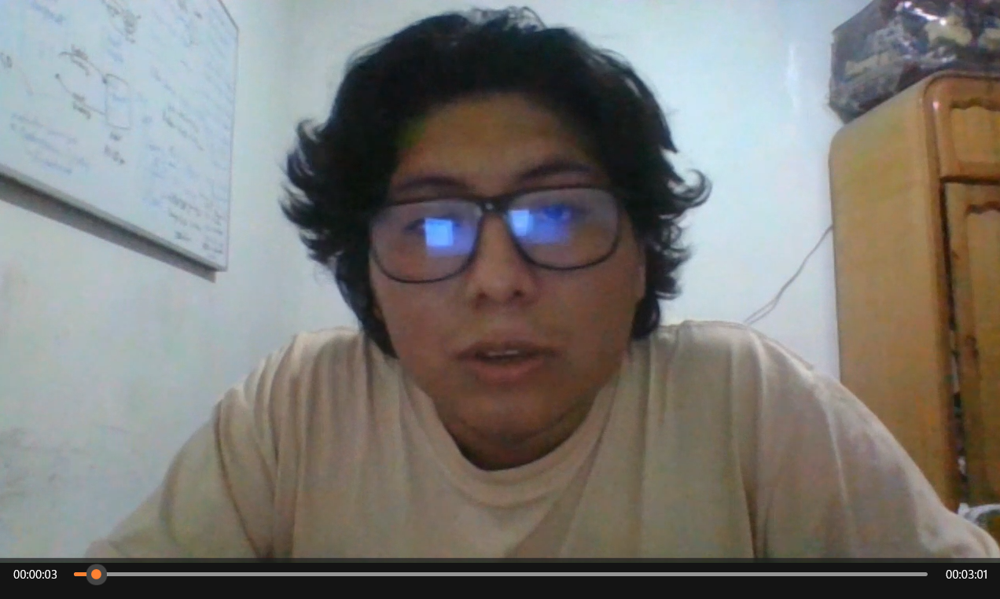

## Conclusiones:
* El desarrollo de User Stories ayudó a mantener un enfoque centrado en las necesidades del usuario final. Al identificar los roles de usuario, sus objetivos y las funcionalidades requeridas para alcanzar esos objetivos, se garantizó que el producto final satisficiera las necesidades reales de los usuarios.

* El uso de técnicas como Impact Mapping ayudó a establecer un mapa claro de los objetivos del proyecto y las formas en que las diferentes funcionalidades contribuirían a esos objetivos. Esto facilitó la planificación y priorización de las tareas .

* La realización de As-Is y To-Be Scenario Mapping permitió una comprensión clara de la situación actual del proceso y cómo se vería el proceso después de la implementación del proyecto. Esto ayudó a identificar áreas de mejora y a visualizar el impacto del proyecto en el negocio.

* Github es una herramienta que facilita la colaboracion entre desarrolladores

* El uso de DDD en el lado backend facilta la organizacion por contextos delimitados y que el codigo sea mas legible

#### Abouth-the-team

link de video: https://upcedupe-my.sharepoint.com/:v:/g/personal/u202117342_upc_edu_pe/EZoDkT8ncMFEs0J6fKqS54gBIfa1eyMlUCGF1g1kWKpyUw?nav=eyJyZWZlcnJhbEluZm8iOnsicmVmZXJyYWxBcHAiOiJPbmVEcml2ZUZvckJ1c2luZXNzIiwicmVmZXJyYWxBcHBQbGF0Zm9ybSI6IldlYiIsInJlZmVycmFsTW9kZSI6InZpZXciLCJyZWZlcnJhbFZpZXciOiJNeUZpbGVzTGlua0NvcHkifX0&e=djmH9j 
